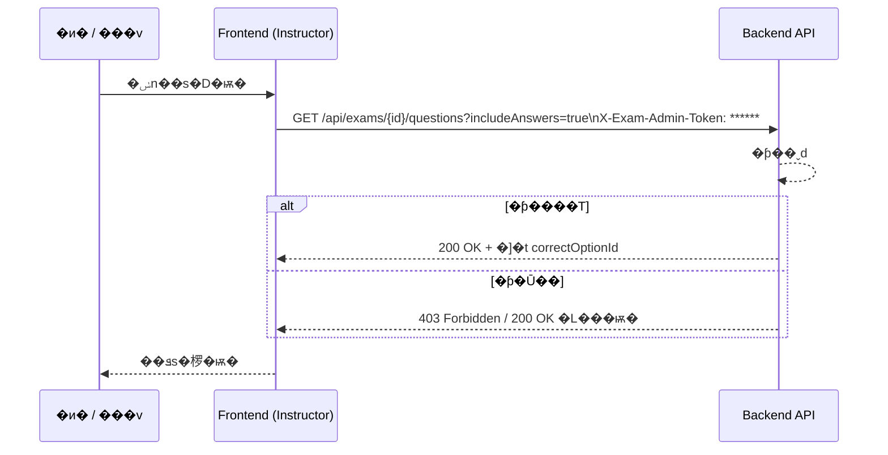

# 即時互動測驗統計系統 - 系統規格文件

## 1. 架構與選型

### 1.1 技術棧
- **前端**：React 18+ + TypeScript + Vite
- **後端**：Spring Boot 3.x + Java 17
- **資料庫**：H2 Database (File-based mode)
- **即時通訊**：WebSocket (STOMP over WebSocket)
- **圖表庫**：Chart.js / Recharts
- **QR Code**：qrcode.react (前端) / ZXing (後端)

### 1.2 系統架構
```
┌─────────────────────────────────────────────────────────────┐
│                         前端層                                │
│  ┌──────────────┐              ┌──────────────┐             │
│  │  講師介面     │              │  學員介面     │             │
│  │  (React)     │              │  (React)     │             │
│  └──────┬───────┘              └──────┬───────┘             │
│         │                              │                      │
└─────────┼──────────────────────────────┼─────────────────────┘
          │                              │
          │   HTTP REST API              │
          │   WebSocket (STOMP)          │
          │                              │
┌─────────┴──────────────────────────────┴─────────────────────┐
│                        應用層                                  │
│  ┌────────────────────────────────────────────────────────┐  │
│  │             Spring Boot Application                    │  │
│  │  ┌──────────────┐  ┌──────────────┐  ┌─────────────┐ │  │
│  │  │ REST         │  │ WebSocket    │  │ QR Code     │ │  │
│  │  │ Controller   │  │ Handler      │  │ Service     │ │  │
│  │  └──────┬───────┘  └──────┬───────┘  └──────┬──────┘ │  │
│  │         │                  │                  │         │  │
│  │  ┌──────┴──────────────────┴──────────────────┴──────┐ │  │
│  │  │             Business Service Layer                │ │  │
│  │  │  - ExamService                                    │ │  │
│  │  │  - SessionService                                 │ │  │
│  │  │  - StatisticsService                             │ │  │
│  │  └──────────────────┬────────────────────────────────┘ │  │
│  │                     │                                   │  │
│  │  ┌──────────────────┴────────────────────────────────┐ │  │
│  │  │             Repository Layer                       │ │  │
│  │  │  - ExamRepository                                  │ │  │
│  │  │  - StudentRepository                               │ │  │
│  │  │  - AnswerRepository                                │ │  │
│  │  └──────────────────┬────────────────────────────────┘ │  │
│  └────────────────────┬────────────────────────────────────┘  │
└───────────────────────┼───────────────────────────────────────┘
                        │
┌───────────────────────┴───────────────────────────────────────┐
│                        資料層                                  │
│                  H2 Database (File-based)                     │
│  ┌──────────┐  ┌──────────┐  ┌──────────┐  ┌──────────┐    │
│  │  Exam    │  │ Question │  │ Student  │  │  Answer  │    │
│  │  測驗表   │  │  題目表   │  │  學員表   │  │  答案表   │    │
│  └──────────┘  └──────────┘  └──────────┘  └──────────┘    │
└───────────────────────────────────────────────────────────────┘
```

### 1.3 �D���ѭ״_�w����
- �[�K `exam.security.admin-token` �ƥ�A�i�ھڱK�n�b `application.yml` �� `application-test.yml` �����w�ŶǤ��v�ƥѡA backend �x�s�� `ExamProperties.Security` ���ڪ��s���C
- `GET /api/exams/{examId}/questions` ���w���^�� `correctOptionId`�A�H�T�O�{���k���W REST API ���|�G�d���ȻP�ѭסC
- �ݮɥ��v���ݭn���o�ѭצ~��A�ݭn�b HTTP Header ���� `X-Exam-Admin-Token` �� �ƥ�A�ΨӦn�[ Query Parameter `includeAnswers=true`�A backend �N�̷��ƥ��T�{�O�_�^��ѭסC
- �������ͭn���ת�p��P�D�ؿ��ܡAbackend �|�{���ƥ��O�_���T�A�ä����O�O `correctOptionId` ���w�A���١u�����ѭסC



### 1.3 設計原則
- **前後端分離**：前端使用 REST API 與 WebSocket 與後端通訊
- **RESTful API**：遵循 REST 規範設計 API
- **即時性**：使用 WebSocket 實現低延遲的即時互動
- **狀態管理**：後端維護測驗狀態機，前端使用 React Context/Redux
- **Session 隔離**：每個學員擁有獨立 Session，防止資料混淆

## 2. 資料模型

### 2.1 實體關係
```
Exam (測驗)
  │
  ├─── 1:N ───> Question (題目)
  │                │
  │                └─── 1:N ───> QuestionOption (選項)
  │
  └─── 1:N ───> Student (學員)
                   │
                   └─── 1:N ───> Answer (答案)
```

### 2.2 資料表結構

#### Exam (測驗表)
| 欄位名稱          | 類型          | 說明                    |
|-------------------|---------------|-------------------------|
| id                | Long          | 主鍵                    |
| title             | String        | 測驗標題                |
| description       | String        | 測驗描述                |
| questionTimeLimit | Integer       | 每題倒數時間（秒）      |
| status            | Enum          | 測驗狀態 (CREATED, STARTED, ENDED) |
| currentQuestionIndex | Integer    | 當前題目索引            |
| accessCode        | String        | 加入碼（QR Code 內容）  |
| createdAt         | LocalDateTime | 建立時間                |
| startedAt         | LocalDateTime | 開始時間                |
| endedAt           | LocalDateTime | 結束時間                |

#### Question (題目表)
| 欄位名稱               | 類型    | 說明                          |
|------------------------|---------|-------------------------------|
| id                     | Long    | 主鍵                          |
| examId                 | Long    | 外鍵 (Exam.id)                |
| questionOrder          | Integer | 題目順序                      |
| questionText           | String  | 題目內容                      |
| correctOptionId        | Long    | 正確答案選項 ID               |
| singleStatChartType    | Enum    | 單題統計圖表類型 (BAR, PIE)   |
| cumulativeChartType    | Enum    | 累積統計圖表類型 (BAR, PIE)   |

#### QuestionOption (選項表)
| 欄位名稱    | 類型    | 說明                    |
|-------------|---------|-------------------------|
| id          | Long    | 主鍵                    |
| questionId  | Long    | 外鍵 (Question.id)      |
| optionOrder | Integer | 選項順序                |
| optionText  | String  | 選項內容                |

#### Student (學員表)
| 欄位名稱    | 類型          | 說明                         |
|-------------|---------------|------------------------------|
| id          | Long          | 主鍵                         |
| examId      | Long          | 外鍵 (Exam.id)               |
| sessionId   | String        | Session ID（UUID）           |
| name        | String        | 學員姓名                     |
| email       | String        | 學員 Email                   |
| avatarIcon  | String        | 頭像圖示名稱                 |
| totalScore  | Integer       | 累積總分                     |
| joinedAt    | LocalDateTime | 加入時間                     |

#### Answer (答案表)
| 欄位名稱         | 類型          | 說明                    |
|------------------|---------------|-------------------------|
| id               | Long          | 主鍵                    |
| studentId        | Long          | 外鍵 (Student.id)       |
| questionId       | Long          | 外鍵 (Question.id)      |
| selectedOptionId | Long          | 外鍵 (QuestionOption.id)|
| isCorrect        | Boolean       | 是否答對                |
| answeredAt       | LocalDateTime | 作答時間                |

## 3. 關鍵流程

### 3.1 講師建立測驗流程
1. 講師填寫測驗資訊（標題、描述、倒數時間）
2. 新增題目與選項，設定正確答案
3. 設定每題的統計圖表類型
4. 系統生成唯一 accessCode
5. 儲存測驗資料（狀態：CREATED）

### 3.2 講師啟動測驗流程
1. 講師點擊「啟動測驗」
2. 系統更新測驗狀態為 STARTED
3. 系統生成包含 accessCode 的 QR Code
   - URL �榡：`{baseUrl}/student/join?accessCode={accessCode}`
4. 顯示 QR Code 及已加入學員數量

### 3.3 學員加入測驗流程
1. 學員掃描 QR Code 獲取 accessCode
2. 跳轉至學員註冊頁面
3. 輸入姓名、Email、選擇頭像
4. 系統建立 Student 記錄並生成 sessionId
5. 透過 WebSocket 通知講師有新學員加入

### 3.4 答題流程
1. 講師點擊「開始題目」
2. 系統透過 WebSocket 推送題目給所有學員
3. 學員在時間內選擇答案
4. 系統記錄 Answer 並即時更新統計
5. 時間到後系統鎖定答案，推送統計結果給所有人
6. 顯示單題統計圖表與累積分數圖表

### 3.5 結束測驗流程
1. 所有題目完成後，系統計算總分排行
2. 推送排行榜資料給講師與所有學員
3. 測驗狀態更新為 ENDED

## 4. 虛擬碼

### 4.1 講師開始題目
```java
// ExamService.java
public void startQuestion(Long examId, Integer questionIndex) {
    // 1. 驗證測驗狀態
    Exam exam = examRepository.findById(examId);
    if (exam.getStatus() != ExamStatus.STARTED) {
        throw new IllegalStateException("測驗尚未啟動");
    }

    // 2. 更新當前題目索引
    exam.setCurrentQuestionIndex(questionIndex);
    examRepository.save(exam);

    // 3. 取得題目資料
    Question question = questionRepository.findByExamIdAndOrder(examId, questionIndex);

    // 4. 透過 WebSocket 推送題目給所有學員
    QuestionDTO questionDTO = buildQuestionDTO(question);
    webSocketService.broadcast("/topic/exam/" + examId + "/question", questionDTO);

    // 5. 啟動倒數計時器
    scheduleQuestionTimeout(examId, question.getId(), exam.getQuestionTimeLimit());
}
```

### 4.2 學員提交答案
```java
// AnswerService.java
public void submitAnswer(Long studentId, Long questionId, Long optionId) {
    // 1. 驗證是否在答題時間內
    Question question = questionRepository.findById(questionId);
    if (isTimeExpired(question)) {
        throw new IllegalStateException("答題時間已結束");
    }

    // 2. 檢查是否已作答
    if (answerRepository.existsByStudentIdAndQuestionId(studentId, questionId)) {
        throw new IllegalStateException("已經作答過此題");
    }

    // 3. 儲存答案
    Answer answer = new Answer();
    answer.setStudentId(studentId);
    answer.setQuestionId(questionId);
    answer.setSelectedOptionId(optionId);
    answer.setIsCorrect(optionId.equals(question.getCorrectOptionId()));
    answer.setAnsweredAt(LocalDateTime.now());
    answerRepository.save(answer);

    // 4. 更新學員總分
    if (answer.getIsCorrect()) {
        Student student = studentRepository.findById(studentId);
        student.setTotalScore(student.getTotalScore() + 1);
        studentRepository.save(student);
    }

    // 5. 即時更新統計
    updateStatistics(question.getExamId(), questionId);
}
```

### 4.3 生成統計圖表
```java
// StatisticsService.java
public StatisticsDTO generateStatistics(Long examId, Long questionId) {
    // 1. 取得所有答案分布
    Map<Long, Long> optionDistribution = answerRepository
        .countByQuestionIdGroupByOption(questionId);

    // 2. 計算累積分數分布
    Map<Integer, Long> scoreDistribution = studentRepository
        .countByExamIdGroupByTotalScore(examId);

    // 3. 建立統計 DTO
    StatisticsDTO dto = new StatisticsDTO();
    dto.setQuestionId(questionId);
    dto.setOptionDistribution(optionDistribution);
    dto.setScoreDistribution(scoreDistribution);

    // 4. 透過 WebSocket 推送統計結果
    webSocketService.broadcast("/topic/exam/" + examId + "/statistics", dto);

    return dto;
}
```

## 5. 系統脈絡圖 (System Context Diagram)

```
                    ┌─────────────────────────────────────┐
                    │                                     │
                    │    即時互動測驗統計系統              │
                    │    (Exam System)                    │
                    │                                     │
                    └─────────────┬───────────────────────┘
                                  │
                    ┌─────────────┴─────────────┐
                    │                           │
            ┌───────▼─────────┐         ┌───────▼─────────┐
            │                 │         │                 │
            │   講師           │         │   學員           │
            │  (Instructor)   │         │  (Student)      │
            │                 │         │                 │
            └─────────────────┘         └─────────────────┘

            使用場景：
            - 講師：建立測驗、控制流程、查看統計
            - 學員：掃碼加入、答題、查看結果
```

## 6. 容器/部署概觀 (Container Diagram)

```
┌─────────────────────────────────────────────────────────────────┐
│                          部署環境 (本地)                          │
│                                                                   │
│  ┌─────────────────────────────────────────────────────────┐    │
│  │              Nginx / HTTP Server (Optional)             │    │
│  │                     Port: 80 / 443                       │    │
│  └───────────────────────────┬─────────────────────────────┘    │
│                              │                                   │
│  ┌───────────────────────────▼─────────────────────────────┐    │
│  │              React Frontend Application                  │    │
│  │                   Build Output (static)                  │    │
│  │                     Port: 5173 (dev)                     │    │
│  └───────────────────────────┬─────────────────────────────┘    │
│                              │                                   │
│                              │ HTTP REST / WebSocket             │
│                              │                                   │
│  ┌───────────────────────────▼─────────────────────────────┐    │
│  │          Spring Boot Backend Application                 │    │
│  │              Embedded Tomcat Server                      │    │
│  │                     Port: 8080                           │    │
│  │                                                          │    │
│  │  - REST API Controllers                                  │    │
│  │  - WebSocket STOMP Endpoints                             │    │
│  │  - Business Logic Services                               │    │
│  │  - H2 Database Connection                                │    │
│  └───────────────────────────┬─────────────────────────────┘    │
│                              │                                   │
│                              │ JDBC                              │
│                              │                                   │
│  ┌───────────────────────────▼─────────────────────────────┐    │
│  │              H2 Database (File-based)                    │    │
│  │              Location: ./data/examdb.mv.db               │    │
│  │                                                          │    │
│  │  - exam.mv.db (資料檔案)                                  │    │
│  │  - exam.trace.db (日誌檔案)                               │    │
│  └──────────────────────────────────────────────────────────┘    │
│                                                                   │
└───────────────────────────────────────────────────────────────────┘
```

## 7. 模組關係圖

### 7.1 後端模組關係圖
```
┌──────────────────────────────────────────────────────────────┐
│                     com.exam.system                          │
├──────────────────────────────────────────────────────────────┤
│                                                              │
│  ┌─────────────────────────────────────────────────────┐   │
│  │                  controller                          │   │
│  │  - ExamController                                    │   │
│  │  - StudentController                                 │   │
│  │  - AnswerController                                  │   │
│  └────────────────────┬─────────────────────────────────┘   │
│                       │                                      │
│                       ▼                                      │
│  ┌─────────────────────────────────────────────────────┐   │
│  │                  service                             │   │
│  │  - ExamService                                       │   │
│  │  - StudentService                                    │   │
│  │  - AnswerService                                     │   │
│  │  - StatisticsService                                 │   │
│  │  - QRCodeService                                     │   │
│  └────────────────────┬─────────────────────────────────┘   │
│                       │                                      │
│                       ▼                                      │
│  ┌─────────────────────────────────────────────────────┐   │
│  │                  repository                          │   │
│  │  - ExamRepository                                    │   │
│  │  - QuestionRepository                                │   │
│  │  - QuestionOptionRepository                          │   │
│  │  - StudentRepository                                 │   │
│  │  - AnswerRepository                                  │   │
│  └────────────────────┬─────────────────────────────────┘   │
│                       │                                      │
│                       ▼                                      │
│  ┌─────────────────────────────────────────────────────┐   │
│  │                   entity                             │   │
│  │  - Exam                                              │   │
│  │  - Question                                          │   │
│  │  - QuestionOption                                    │   │
│  │  - Student                                           │   │
│  │  - Answer                                            │   │
│  └──────────────────────────────────────────────────────┘   │
│                                                              │
│  ┌─────────────────────────────────────────────────────┐   │
│  │                  websocket                           │   │
│  │  - WebSocketConfig                                   │   │
│  │  - WebSocketMessageHandler                           │   │
│  │  - WebSocketService                                  │   │
│  └──────────────────────────────────────────────────────┘   │
│                                                              │
│  ┌─────────────────────────────────────────────────────┐   │
│  │                    dto                               │   │
│  │  - ExamDTO, QuestionDTO, AnswerDTO                   │   │
│  │  - StatisticsDTO, LeaderboardDTO                     │   │
│  └──────────────────────────────────────────────────────┘   │
│                                                              │
└──────────────────────────────────────────────────────────────┘
```

### 7.2 前端模組關係圖
```
┌──────────────────────────────────────────────────────────────┐
│                        src/                                  │
├──────────────────────────────────────────────────────────────┤
│                                                              │
│  ┌─────────────────────────────────────────────────────┐   │
│  │                    pages/                            │   │
│  │  - InstructorDashboard (講師主控台)                   │   │
│  │  - ExamCreator (測驗建立頁)                           │   │
│  │  - ExamMonitor (測驗監控頁)                           │   │
│  │  - StudentJoin (學員加入頁)                           │   │
│  │  - StudentExam (學員答題頁)                           │   │
│  │  - Leaderboard (排行榜頁)                             │   │
│  └────────────────────┬─────────────────────────────────┘   │
│                       │                                      │
│                       ▼                                      │
│  ┌─────────────────────────────────────────────────────┐   │
│  │                  components/                         │   │
│  │  - QRCodeDisplay (QR Code 顯示)                      │   │
│  │  - QuestionCard (題目卡片)                            │   │
│  │  - OptionButton (選項按鈕)                            │   │
│  │  - CountdownTimer (倒數計時器)                        │   │
│  │  - BarChart (長條圖)                                  │   │
│  │  - PieChart (圓餅圖)                                  │   │
│  │  - StudentList (學員列表)                             │   │
│  │  - AvatarSelector (頭像選擇器)                        │   │
│  └────────────────────┬─────────────────────────────────┘   │
│                       │                                      │
│                       ▼                                      │
│  ┌─────────────────────────────────────────────────────┐   │
│  │                   services/                          │   │
│  │  - apiService (HTTP API 呼叫)                         │   │
│  │  - websocketService (WebSocket 連線管理)             │   │
│  └────────────────────┬─────────────────────────────────┘   │
│                       │                                      │
│                       ▼                                      │
│  ┌─────────────────────────────────────────────────────┐   │
│  │                   store/                             │   │
│  │  - examStore (測驗狀態管理)                           │   │
│  │  - studentStore (學員狀態管理)                        │   │
│  │  - statisticsStore (統計資料管理)                     │   │
│  └──────────────────────────────────────────────────────┘   │
│                                                              │
│  ┌─────────────────────────────────────────────────────┐   │
│  │                   types/                             │   │
│  │  - exam.types.ts                                     │   │
│  │  - student.types.ts                                  │   │
│  │  - statistics.types.ts                               │   │
│  └──────────────────────────────────────────────────────┘   │
│                                                              │
│  ┌─────────────────────────────────────────────────────┐   │
│  │                   hooks/                             │   │
│  │  - useWebSocket (WebSocket Hook)                     │   │
│  │  - useCountdown (倒數計時 Hook)                       │   │
│  └──────────────────────────────────────────────────────┘   │
│                                                              │
└──────────────────────────────────────────────────────────────┘
```

## 8. 序列圖

### 8.1 學員加入測驗序列圖
```
學員          前端          後端          資料庫          WebSocket
 │             │             │             │               │
 │──掃描QR─────►│             │             │               │
 │             │             │             │               │
 │◄──顯示註冊───│             │             │               │
 │             │             │             │               │
 │──填寫資料────►│             │             │               │
 │             │             │             │               │
 │             │─POST /students/join───────►│               │
 │             │             │             │               │
 │             │             │─INSERT──────►│               │
 │             │             │             │               │
 │             │             │◄─Student────│               │
 │             │             │             │               │
 │             │◄─sessionId──│             │               │
 │             │             │             │               │
 │             │             │────通知新學員加入─────────────►│
 │             │             │             │               │
 │             │             │             │               │
 │◄─加入成功────│             │             │               │
 │             │             │             │               │
```

### 8.2 答題流程序列圖
```
講師         前端(講師)      後端       前端(學員)      學員
 │             │             │             │             │
 │──點擊開始────►│             │             │             │
 │             │             │             │             │
 │             │─POST /exams/{id}/start-question──────────►│
 │             │             │             │             │
 │             │             │────broadcast question────►│
 │             │             │             │             │
 │             │             │             │◄────────────│
 │             │             │             │             │
 │             │             │             │─顯示題目────►學員
 │             │             │             │             │
 │             │             │             │             │
 │             │             │             │◄─選擇答案───│
 │             │             │             │             │
 │             │             │◄POST /answers/submit──────│
 │             │             │             │             │
 │             │             │─儲存答案────►DB            │
 │             │             │             │             │
 │  [時間到]    │             │             │             │
 │             │             │             │             │
 │             │             │─計算統計────►│             │
 │             │             │             │             │
 │             │             │────broadcast statistics──►│
 │             │             │             │             │
 │◄─顯示統計────│◄────────────│             │◄────────────│
 │             │             │             │             │
```

### 8.3 結束測驗與排行榜序列圖
```
講師         前端(講師)      後端       前端(學員)      學員
 │             │             │             │             │
 │─點擊結束─────►│             │             │             │
 │             │             │             │             │
 │             │─POST /exams/{id}/end─────►│             │
 │             │             │             │             │
 │             │             │─計算排行榜──►DB            │
 │             │             │             │             │
 │             │             │◄─排行榜資料─│             │
 │             │             │             │             │
 │             │             │────broadcast leaderboard─►│
 │             │             │             │             │
 │◄─顯示排行榜──│◄────────────│             │◄────────────│
 │             │             │             │──顯示排行榜──►學員
 │             │             │             │             │
```

## 9. ER 圖 (Entity Relationship Diagram)

```
┌─────────────────────────┐
│        Exam             │
│─────────────────────────│
│ PK: id                  │
│     title               │
│     description         │
│     questionTimeLimit   │
│     status              │
│     currentQuestionIndex│
│     accessCode          │
│     createdAt           │
│     startedAt           │
│     endedAt             │
└───────┬─────────────────┘
        │
        │ 1
        │
        │ N
        │
┌───────▼─────────────────┐         ┌─────────────────────────┐
│      Question           │         │     QuestionOption      │
│─────────────────────────│         │─────────────────────────│
│ PK: id                  │    1    │ PK: id                  │
│ FK: examId              ├─────────┤ FK: questionId          │
│     questionOrder       │    N    │     optionOrder         │
│     questionText        │         │     optionText          │
│     correctOptionId     │         └─────────────────────────┘
│     singleStatChartType │
│     cumulativeChartType │
└───────┬─────────────────┘
        │
        │ 1
        │
        │ N
        │
┌───────▼─────────────────┐
│       Answer            │
│─────────────────────────│
│ PK: id                  │
│ FK: studentId           │
│ FK: questionId          │
│ FK: selectedOptionId    │
│     isCorrect           │
│     answeredAt          │
└───────▲─────────────────┘
        │
        │ N
        │
        │ 1
        │
┌───────┴─────────────────┐
│       Student           │
│─────────────────────────│
│ PK: id                  │
│ FK: examId              │
│     sessionId           │
│     name                │
│     email               │
│     avatarIcon          │
│     totalScore          │
│     joinedAt            │
└─────────────────────────┘
        │
        │ N
        │
        │ 1
        │
        └─────────────────────► Exam
```

## 10. 類別圖（後端關鍵類別）

```
┌─────────────────────────────────────┐
│         <<Entity>>                  │
│            Exam                     │
├─────────────────────────────────────┤
│ - id: Long                          │
│ - title: String                     │
│ - description: String               │
│ - questionTimeLimit: Integer        │
│ - status: ExamStatus                │
│ - currentQuestionIndex: Integer     │
│ - accessCode: String                │
│ - createdAt: LocalDateTime          │
│ - startedAt: LocalDateTime          │
│ - endedAt: LocalDateTime            │
│ - questions: List<Question>         │
│ - students: List<Student>           │
├─────────────────────────────────────┤
│ + start(): void                     │
│ + end(): void                       │
│ + goToNextQuestion(): void          │
└─────────────────────────────────────┘
                 │
                 │ 1
                 │
                 │ *
                 │
┌────────────────▼────────────────────┐
│         <<Entity>>                  │
│           Question                  │
├─────────────────────────────────────┤
│ - id: Long                          │
│ - exam: Exam                        │
│ - questionOrder: Integer            │
│ - questionText: String              │
│ - correctOptionId: Long             │
│ - singleStatChartType: ChartType    │
│ - cumulativeChartType: ChartType    │
│ - options: List<QuestionOption>     │
├─────────────────────────────────────┤
│ + isCorrectAnswer(Long): boolean    │
└─────────────────────────────────────┘

┌─────────────────────────────────────┐
│         <<Service>>                 │
│          ExamService                │
├─────────────────────────────────────┤
│ - examRepository: ExamRepository    │
│ - questionRepository: ...           │
│ - webSocketService: ...             │
├─────────────────────────────────────┤
│ + createExam(ExamDTO): Exam         │
│ + startExam(Long): void             │
│ + startQuestion(Long, Integer): void│
│ + endExam(Long): void               │
│ + generateAccessCode(): String      │
└─────────────────────────────────────┘

┌─────────────────────────────────────┐
│         <<Service>>                 │
│        AnswerService                │
├─────────────────────────────────────┤
│ - answerRepository: AnswerRepository│
│ - studentRepository: ...            │
│ - statisticsService: ...            │
├─────────────────────────────────────┤
│ + submitAnswer(AnswerDTO): Answer   │
│ + validateAnswerTime(Long): boolean │
│ + calculateScore(Long): Integer     │
└─────────────────────────────────────┘

┌─────────────────────────────────────┐
│         <<Service>>                 │
│      StatisticsService              │
├─────────────────────────────────────┤
│ - answerRepository: AnswerRepository│
│ - studentRepository: ...            │
│ - webSocketService: ...             │
├─────────────────────────────────────┤
│ + generateQuestionStats(Long): ...  │
│ + generateCumulativeStats(Long): ...│
│ + generateLeaderboard(Long): ...    │
│ + broadcastStatistics(Long): void   │
└─────────────────────────────────────┘

┌─────────────────────────────────────┐
│         <<Service>>                 │
│       WebSocketService              │
├─────────────────────────────────────┤
│ - simpMessagingTemplate: ...        │
├─────────────────────────────────────┤
│ + broadcast(String, Object): void   │
│ + sendToUser(String, String, ...): void │
└─────────────────────────────────────┘
```

## 11. 流程圖

### 11.1 講師操作主流程
```
         [開始]
            │
            ▼
      ┌─────────┐
      │建立測驗  │
      └────┬────┘
           │
           ▼
      ┌─────────┐
      │新增題目  │
      └────┬────┘
           │
           ▼
      ┌─────────┐
      │設定選項  │
      └────┬────┘
           │
           ▼
      ┌─────────┐
      │啟動測驗  │
      └────┬────┘
           │
           ▼
      ┌─────────┐
      │顯示QR Code│
      └────┬────┘
           │
           ▼
      ┌─────────┐
      │等待學員  │
      └────┬────┘
           │
           ▼
      ┌─────────┐
      │開始題目  │◄──────┐
      └────┬────┘        │
           │             │
           ▼             │
      ┌─────────┐        │
      │等待作答  │        │
      └────┬────┘        │
           │             │
           ▼             │
      ┌─────────┐        │
      │查看統計  │        │
      └────┬────┘        │
           │             │
           ▼             │
        <還有題目?>───是───┘
           │
          否
           │
           ▼
      ┌─────────┐
      │結束測驗  │
      └────┬────┘
           │
           ▼
      ┌─────────┐
      │顯示排行榜│
      └────┬────┘
           │
           ▼
         [結束]
```

### 11.2 學員操作流程
```
         [開始]
            │
            ▼
      ┌─────────┐
      │掃描QR Code│
      └────┬────┘
           │
           ▼
      ┌─────────┐
      │輸入資料  │
      └────┬────┘
           │
           ▼
      ┌─────────┐
      │選擇頭像  │
      └────┬────┘
           │
           ▼
      ┌─────────┐
      │加入測驗  │
      └────┬────┘
           │
           ▼
      ┌─────────┐
      │等待開始  │
      └────┬────┘
           │
           ▼
      ┌─────────┐
      │顯示題目  │◄──────┐
      └────┬────┘        │
           │             │
           ▼             │
      ┌─────────┐        │
      │選擇答案  │        │
      └────┬────┘        │
           │             │
           ▼             │
      ┌─────────┐        │
      │提交答案  │        │
      └────┬────┘        │
           │             │
           ▼             │
      ┌─────────┐        │
      │查看統計  │        │
      └────┬────┘        │
           │             │
           ▼             │
        <還有題目?>───是───┘
           │
          否
           │
           ▼
      ┌─────────┐
      │查看排行榜│
      └────┬────┘
           │
           ▼
         [結束]
```

### 11.3 答案提交驗證流程
```
       [學員提交答案]
            │
            ▼
      ┌─────────────┐
      │檢查測驗狀態  │
      └──────┬──────┘
             │
             ▼
        <測驗進行中?>───否──►[拒絕：測驗未開始/已結束]
             │
            是
             │
             ▼
      ┌─────────────┐
      │檢查答題時間  │
      └──────┬──────┘
             │
             ▼
        <時間內?>───否──►[拒絕：答題時間已結束]
             │
            是
             │
             ▼
      ┌─────────────┐
      │檢查是否重複  │
      └──────┬──────┘
             │
             ▼
        <已作答?>───是──►[拒絕：已經作答過]
             │
            否
             │
             ▼
      ┌─────────────┐
      │儲存答案     │
      └──────┬──────┘
             │
             ▼
      ┌─────────────┐
      │判斷正確性    │
      └──────┬──────┘
             │
             ▼
        <答對?>───是──►[更新學員分數 +1]
             │              │
            否              │
             │              │
             └──────┬───────┘
                    │
                    ▼
             ┌─────────────┐
             │更新即時統計  │
             └──────┬──────┘
                    │
                    ▼
                [成功]
```

## 12. 狀態圖

### 12.1 測驗狀態圖
```
          ┌─────────────┐
          │   CREATED   │
          │  (已建立)    │
          └──────┬──────┘
                 │
         start() │
                 │
                 ▼
          ┌─────────────┐
          │   STARTED   │◄────┐
          │  (進行中)    │      │
          └──────┬──────┘      │
                 │             │
     startQuestion() │    nextQuestion()
                 │             │
                 ▼             │
          ┌─────────────┐     │
          │ ANSWERING   │     │
          │  (答題中)    │─────┘
          └──────┬──────┘
                 │
        timeout()/endQuestion()
                 │
                 ▼
          ┌─────────────┐
          │ REVIEWING   │
          │  (檢視統計)  │
          └──────┬──────┘
                 │
      <還有題目?> │
           │     │
          否     是
           │     │
           │     └─────► nextQuestion() ──┐
           │                               │
           │                               │
           ▼                               │
    ┌─────────────┐                       │
    │    ENDED    │◄──────────────────────┘
    │  (已結束)    │       end()
    └─────────────┘
```

### 12.2 學員狀態圖
```
          ┌─────────────┐
          │   JOINED    │
          │  (已加入)    │
          └──────┬──────┘
                 │
         測驗開始  │
                 │
                 ▼
          ┌─────────────┐
          │   WAITING   │
          │  (等待題目)  │
          └──────┬──────┘
                 │
        接收新題目 │
                 │
                 ▼
          ┌─────────────┐
          │  ANSWERING  │◄────┐
          │  (作答中)    │      │
          └──────┬──────┘      │
                 │             │
           提交答案 │        接收新題目
                 │             │
                 ▼             │
          ┌─────────────┐     │
          │  REVIEWING  │     │
          │ (檢視結果)   │─────┘
          └──────┬──────┘
                 │
         測驗結束  │
                 │
                 ▼
          ┌─────────────┐
          │  FINISHED   │
          │ (已完成)     │
          └─────────────┘
```

### 12.3 題目狀態圖
```
          ┌─────────────┐
          │   PENDING   │
          │  (等待中)    │
          └──────┬──────┘
                 │
        講師開始題目 │
                 │
                 ▼
          ┌─────────────┐
          │   ACTIVE    │
          │  (進行中)    │
          └──────┬──────┘
                 │
      時間到/講師結束 │
                 │
                 ▼
          ┌─────────────┐
          │   CLOSED    │
          │  (已關閉)    │
          └──────┬──────┘
                 │
        統計計算完成 │
                 │
                 ▼
          ┌─────────────┐
          │  REVIEWED   │
          │ (已檢視)     │
          └─────────────┘
```

## 13. 非功能性需求

### 13.1 效能需求
- 支援 300 個同時連線學員
- WebSocket 訊息延遲 < 500ms
- API 回應時間 < 1 秒
- 頁面載入時間 < 3 秒

### 13.2 可靠性需求
- 資料持久化（H2 file-based）
- Session 重連機制
- 錯誤處理與日誌記錄

### 13.3 安全性需求
- accessCode 唯一性驗證
- Session ID 防偽造
- CORS 設定
- XSS/CSRF 防護

### 13.4 可用性需求
- 響應式設計（支援手機/平板/電腦）
- 直覺的使用者介面
- 即時狀態回饋

## 14. 技術挑戰與解決方案

### 14.1 並發控制
**挑戰**：300 個學員同時提交答案
**解決方案**：
- 使用 Spring 的 @Transactional 確保資料一致性
- 樂觀鎖（@Version）防止資料衝突
- 非同步處理統計計算

### 14.2 即時性
**挑戰**：確保所有學員同步接收題目與統計
**解決方案**：
- WebSocket (STOMP) 進行雙向通訊
- 使用 Topic 廣播機制
- 前端實作重連機制

### 14.3 Session 管理
**挑戰**：每個學員獨立 Session
**實作重點**：
- 使用 UUID 作為 sessionId
- 維持單一 Session 與生命週期管理
- 透過 localStorage 同步儲存 `sessionId` 與 `currentStudent`，重新整理（F5）即可立即還原畫面，再視情況呼叫 API 取得最新資料
- StudentExam 重新整理時需等待 Zustand `persist` hydration（`hasHydrated = true`）完成後，再以 sessionId 打 API 以確保資料正確
- StudentJoin 導向 StudentExam 時需帶上 `/student/exam/{examId}?sessionId={UUID}`，讓 StudentExam 可以從 URL 或 localStorage 取得 sessionId，即使瀏覽器限制 localStorage 也能恢復狀態


### 14.4 資料一致性
**挑戰**：統計資料即時更新
**解決方案**：
- 每次答案提交後立即更新統計
- 使用 Redis（未來擴展）快取統計結果
- 分散式鎖防止重複計算

## 15. 開發與測試計畫

### 15.1 開發階段
1. **Phase 1**：後端基礎架構 (資料模型、Repository)
2. **Phase 2**：後端 API 實作 (REST + WebSocket)
3. **Phase 3**：前端框架搭建 (React + TypeScript)
4. **Phase 4**：講師端功能開發
5. **Phase 5**：學員端功能開發
6. **Phase 6**：整合測試與壓力測試

### 15.2 測試策略
- **單元測試**：Service 層、Repository 層
- **整合測試**：API 端到端測試
- **WebSocket 測試**：即時通訊測試
- **壓力測試**：JMeter 模擬 300 並發連線
- **UI 測試**：手機/平板/電腦多裝置測試

---

**文件版本**：v1.0
**最後更新**：2025-09-30
