# 即時互動測驗統計系統 - 系統規格文件

> 文件定位：本文件已升級為 `v2.0-draft` 規劃版。現行 v1 功能仍可運作，V2 章節定義後續最小改動演進方案。

## 1. 架構與選型

### 1.1 技術棧
- **前端**：React 18+ + TypeScript + Vite
- **後端**：Spring Boot 3.x + Java 21
- **資料庫**：PostgreSQL（主要環境）/ H2（註解保留）
- **即時通訊**：WebSocket (STOMP over WebSocket)
- **圖表庫**：Chart.js / Recharts
- **QR Code**：qrcode.react (前端) / ZXing (後端)

### 1.2 系統架構
```
┌─────────────────────────────────────────────────────────────┐
│                         前端層                                │
│  ┌──────────────┐              ┌──────────────┐             │
│  │  講師介面     │              │  學員介面     │             │
│  │  (React)     │              │  (React)     │             │
│  └──────┬───────┘              └──────┬───────┘             │
│         │                              │                      │
└─────────┼──────────────────────────────┼─────────────────────┘
          │                              │
          │   HTTP REST API              │
          │   WebSocket (STOMP)          │
          │                              │
┌─────────┴──────────────────────────────┴─────────────────────┐
│                        應用層                                  │
│  ┌────────────────────────────────────────────────────────┐  │
│  │             Spring Boot Application                    │  │
│  │  ┌──────────────┐  ┌──────────────┐  ┌─────────────┐ │  │
│  │  │ REST         │  │ WebSocket    │  │ QR Code     │ │  │
│  │  │ Controller   │  │ Handler      │  │ Service     │ │  │
│  │  └──────┬───────┘  └──────┬───────┘  └──────┬──────┘ │  │
│  │         │                  │                  │         │  │
│  │  ┌──────┴──────────────────┴──────────────────┴──────┐ │  │
│  │  │             Business Service Layer                │ │  │
│  │  │  - ExamService                                    │ │  │
│  │  │  - SessionService                                 │ │  │
│  │  │  - StatisticsService                             │ │  │
│  │  └──────────────────┬────────────────────────────────┘ │  │
│  │                     │                                   │  │
│  │  ┌──────────────────┴────────────────────────────────┐ │  │
│  │  │             Repository Layer                       │ │  │
│  │  │  - ExamRepository                                  │ │  │
│  │  │  - StudentRepository                               │ │  │
│  │  │  - AnswerRepository                                │ │  │
│  │  └──────────────────┬────────────────────────────────┘ │  │
│  └────────────────────┬────────────────────────────────────┘  │
└───────────────────────┼───────────────────────────────────────┘
                        │
┌───────────────────────┴───────────────────────────────────────┐
│                        資料層                                  │
│                  PostgreSQL Database（主要環境）               │
│  ┌──────────┐  ┌──────────┐  ┌──────────┐  ┌──────────┐    │
│  │  Exam    │  │ Question │  │ Student  │  │  Answer  │    │
│  │  測驗表   │  │  題目表   │  │  學員表   │  │  答案表   │    │
│  └──────────┘  └──────────┘  └──────────┘  └──────────┘    │
└───────────────────────────────────────────────────────────────┘
```

### 1.3 �D���ѭ״_�w����
- �[�K `exam.security.admin-token` �ƥ�A�i�ھڱK�n�b `application.yml` �� `application-test.yml` �����w�ŶǤ��v�ƥѡA backend �x�s�� `ExamProperties.Security` ���ڪ��s���C
- `GET /api/exams/{examId}/questions` ���w���^�� `correctOptionId`�A�H�T�O�{���k���W REST API ���|�G�d���ȻP�ѭסC
- �ݮɥ��v���ݭn���o�ѭצ~��A�ݭn�b HTTP Header ���� `X-Exam-Admin-Token` �� �ƥ�A�ΨӦn�[ Query Parameter `includeAnswers=true`�A backend �N�̷��ƥ��T�{�O�_�^��ѭסC
- �������ͭn���ת�p��P�D�ؿ��ܡAbackend �|�{���ƥ��O�_���T�A�ä����O�O `correctOptionId` ���w�A���١u�����ѭסC

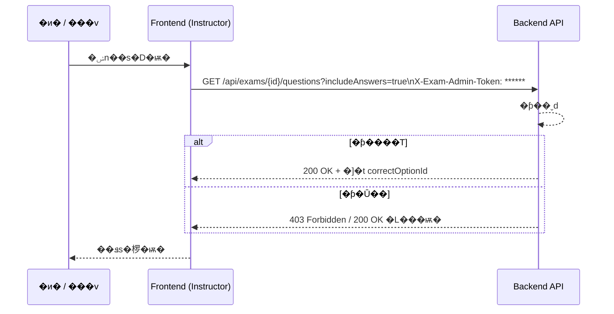
```mermaid
sequenceDiagram
    participant I as �и� / ���v
    participant FE as Frontend (Instructor)
    participant BE as Backend API

    I->>FE: �ݭn��s�D�ѭ�
    FE->>BE: GET /api/exams/{id}/questions?includeAnswers=true\nX-Exam-Admin-Token: ******
    BE-->>BE: �ƥ��ˬd
    alt �ƥ����T
        BE-->>FE: 200 OK + �]�t correctOptionId
    else �ƥ�Ū��
        BE-->>FE: 403 Forbidden / 200 OK �L���ѭ�
    end
    FE-->>I: ��ܦs�椤�ѭ�
```

### 1.3 設計原則
- **前後端分離**：前端使用 REST API 與 WebSocket 與後端通訊
- **RESTful API**：遵循 REST 規範設計 API
- **即時性**：使用 WebSocket 實現低延遲的即時互動
- **狀態管理**：後端維護測驗狀態機，前端使用 React Context/Redux
- **Session 隔離**：每個學員擁有獨立 Session，防止資料混淆

## 2. 資料模型

### 2.1 實體關係
```
Exam (測驗)
  │
  ├─── 1:N ───> Question (題目)
  │                │
  │                └─── 1:N ───> QuestionOption (選項)
  │
  ├─── 1:N ───> ExamSurveyFieldConfig (測驗調查欄位配置)
  │                │
  │                └─── N:1 ───> SurveyField (調查欄位)
  │
  └─── 1:N ───> Student (學員)
                   │
                   └─── 1:N ───> Answer (答案)
```

### 2.2 資料表結構

#### Exam (測驗表)
| 欄位名稱          | 類型          | 說明                    |
|-------------------|---------------|-------------------------|
| id                | Long          | 主鍵                    |
| title             | String        | 測驗標題                |
| description       | String        | 測驗描述                |
| questionTimeLimit | Integer       | 每題倒數時間（秒）      |
| status            | Enum          | 測驗狀態 (CREATED, STARTED, ENDED) |
| currentQuestionIndex | Integer    | 當前題目索引            |
| accessCode        | String        | 加入碼（QR Code 內容）  |
| createdAt         | LocalDateTime | 建立時間                |
| startedAt         | LocalDateTime | 開始時間                |
| endedAt           | LocalDateTime | 結束時間                |

#### Question (題目表)
| 欄位名稱               | 類型    | 說明                          |
|------------------------|---------|-------------------------------|
| id                     | Long    | 主鍵                          |
| examId                 | Long    | 外鍵 (Exam.id)                |
| questionOrder          | Integer | 題目順序                      |
| questionText           | String  | 題目內容                      |
| correctOptionId        | Long    | 正確答案選項 ID               |
| singleStatChartType    | Enum    | 單題統計圖表類型 (BAR, PIE)   |
| cumulativeChartType    | Enum    | 累積統計圖表類型 (BAR, PIE)   |

#### QuestionOption (選項表)
| 欄位名稱    | 類型    | 說明                    |
|-------------|---------|-------------------------|
| id          | Long    | 主鍵                    |
| questionId  | Long    | 外鍵 (Question.id)      |
| optionOrder | Integer | 選項順序                |
| optionText  | String  | 選項內容                |

#### ExamSurveyFieldConfig (測驗調查欄位配置表)
| 欄位名稱      | 類型    | 說明                            |
|---------------|---------|--------------------------------|
| id            | Long    | 主鍵                            |
| examId        | Long    | 外鍵 (Exam.id)                  |
| surveyFieldId | Long    | 外鍵 (SurveyField.id)           |
| isRequired    | Boolean | 是否必填                        |
| displayOrder  | Integer | 顯示順序                        |

#### SurveyField (調查欄位表)
| 欄位名稱     | 類型          | 說明                          |
|--------------|---------------|------------------------------|
| id           | Long          | 主鍵                          |
| fieldKey     | String        | 欄位唯一鍵（如 "occupation"） |
| fieldName    | String        | 欄位顯示名稱（如 "職業"）      |
| fieldType    | String        | 欄位類型（SELECT）             |
| options      | JSON          | 選項列表                      |
| isActive     | Boolean       | 是否啟用                      |
| displayOrder | Integer       | 全域顯示順序                  |
| createdAt    | LocalDateTime | 建立時間                      |
| updatedAt    | LocalDateTime | 更新時間                      |

#### Student (學員表)
| 欄位名稱    | 類型          | 說明                         |
|-------------|---------------|------------------------------|
| id          | Long          | 主鍵                         |
| examId      | Long          | 外鍵 (Exam.id)               |
| sessionId   | String        | Session ID（UUID）           |
| name        | String        | 學員姓名                     |
| email       | String        | 學員 Email                   |
| occupation  | String        | 學員職業（保留向下兼容）      |
| surveyData  | JSON          | 調查資料（其他調查欄位回答）  |
| avatarIcon  | String        | 頭像圖示名稱                 |
| totalScore  | Integer       | 累積總分                     |
| joinedAt    | LocalDateTime | 加入時間                     |

#### Answer (答案表)
| 欄位名稱         | 類型          | 說明                    |
|------------------|---------------|-------------------------|
| id               | Long          | 主鍵                    |
| studentId        | Long          | 外鍵 (Student.id)       |
| questionId       | Long          | 外鍵 (Question.id)      |
| selectedOptionId | Long          | 外鍵 (QuestionOption.id)|
| isCorrect        | Boolean       | 是否答對                |
| answeredAt       | LocalDateTime | 作答時間                |

## 3. 關鍵流程

### 3.1 講師建立測驗流程
1. 講師填寫測驗資訊（標題、描述、倒數時間）
2. 新增題目與選項，設定正確答案
3. 設定每題的統計圖表類型
4. 系統生成唯一 accessCode
5. 儲存測驗資料（狀態：CREATED）

### 3.1.1 題目與選項順序調整流程
1. 講師在編輯測驗時可調整題目順序（拖曳或按鈕）
2. 講師在編輯題目時可調整選項順序（拖曳或按鈕）
3. 系統更新對應的 `questionOrder` 或 `optionOrder` 欄位
4. 前端即時反映順序變更
5. 限制：僅在測驗狀態為 CREATED 時可調整順序

### 3.2 講師啟動測驗流程
1. 講師點擊「啟動測驗」
2. 系統更新測驗狀態為 STARTED
3. 系統生成包含 accessCode 的 QR Code
   - URL �榡：`{baseUrl}/student/join?accessCode={accessCode}`
4. 顯示 QR Code 及已加入學員數量

### 3.3 學員加入測驗流程
1. 學員掃描 QR Code 獲取 accessCode
2. 跳轉至學員註冊頁面
3. 輸入姓名、Email、選擇頭像
4. 系統建立 Student 記錄並生成 sessionId
5. 透過 WebSocket 通知講師有新學員加入

### 3.4 答題流程
1. 講師點擊「開始題目」
2. 系統透過 WebSocket 推送題目給所有學員
3. 學員在時間內選擇答案
4. 系統記錄 Answer 並即時更新統計
5. 時間到後系統鎖定答案，推送統計結果給所有人
6. 顯示單題統計圖表與累積分數圖表

### 3.5 結束測驗流程
1. 所有題目完成後，系統計算總分排行
2. 推送排行榜資料給講師與所有學員
3. 測驗狀態更新為 ENDED

## 4. 虛擬碼

### 4.1 講師開始題目
```java
// ExamService.java
public void startQuestion(Long examId, Integer questionIndex) {
    // 1. 驗證測驗狀態
    Exam exam = examRepository.findById(examId);
    if (exam.getStatus() != ExamStatus.STARTED) {
        throw new IllegalStateException("測驗尚未啟動");
    }

    // 2. 更新當前題目索引
    exam.setCurrentQuestionIndex(questionIndex);
    examRepository.save(exam);

    // 3. 取得題目資料
    Question question = questionRepository.findByExamIdAndOrder(examId, questionIndex);

    // 4. 透過 WebSocket 推送題目給所有學員
    QuestionDTO questionDTO = buildQuestionDTO(question);
    webSocketService.broadcast("/topic/exam/" + examId + "/question", questionDTO);

    // 5. 啟動倒數計時器
    scheduleQuestionTimeout(examId, question.getId(), exam.getQuestionTimeLimit());
}
```

### 4.2 學員提交答案
```java
// AnswerService.java
public void submitAnswer(Long studentId, Long questionId, Long optionId) {
    // 1. 驗證是否在答題時間內
    Question question = questionRepository.findById(questionId);
    if (isTimeExpired(question)) {
        throw new IllegalStateException("答題時間已結束");
    }

    // 2. 檢查是否已作答
    if (answerRepository.existsByStudentIdAndQuestionId(studentId, questionId)) {
        throw new IllegalStateException("已經作答過此題");
    }

    // 3. 儲存答案
    Answer answer = new Answer();
    answer.setStudentId(studentId);
    answer.setQuestionId(questionId);
    answer.setSelectedOptionId(optionId);
    answer.setIsCorrect(optionId.equals(question.getCorrectOptionId()));
    answer.setAnsweredAt(LocalDateTime.now());
    answerRepository.save(answer);

    // 4. 更新學員總分
    if (answer.getIsCorrect()) {
        Student student = studentRepository.findById(studentId);
        student.setTotalScore(student.getTotalScore() + 1);
        studentRepository.save(student);
    }

    // 5. 即時更新統計
    updateStatistics(question.getExamId(), questionId);
}
```

### 4.3 生成統計圖表
```java
// StatisticsService.java
public StatisticsDTO generateStatistics(Long examId, Long questionId) {
    // 1. 取得所有答案分布
    Map<Long, Long> optionDistribution = answerRepository
        .countByQuestionIdGroupByOption(questionId);

    // 2. 計算累積分數分布
    Map<Integer, Long> scoreDistribution = studentRepository
        .countByExamIdGroupByTotalScore(examId);

    // 3. 建立統計 DTO
    StatisticsDTO dto = new StatisticsDTO();
    dto.setQuestionId(questionId);
    dto.setOptionDistribution(optionDistribution);
    dto.setScoreDistribution(scoreDistribution);

    // 4. 透過 WebSocket 推送統計結果
    webSocketService.broadcast("/topic/exam/" + examId + "/statistics", dto);

    return dto;
}
```

### 4.4 調整題目順序
```java
// ExamService.java
@Transactional
public void reorderQuestions(Long examId, List<Long> questionIds) {
    // 1. 驗證測驗狀態（僅 CREATED 狀態可調整）
    Exam exam = examRepository.findById(examId);
    if (exam.getStatus() != ExamStatus.CREATED) {
        throw new BusinessException("測驗已啟動，無法調整順序");
    }

    // 2. 驗證題目數量與所屬關係
    List<Question> questions = questionRepository.findByExamId(examId);
    if (questions.size() != questionIds.size()) {
        throw new BusinessException("題目數量不符");
    }

    // 3. 更新每個題目的順序
    for (int i = 0; i < questionIds.size(); i++) {
        Long questionId = questionIds.get(i);
        Question question = questionRepository.findById(questionId)
            .orElseThrow(() -> new ResourceNotFoundException("Question", questionId));

        if (!question.getExam().getId().equals(examId)) {
            throw new BusinessException("題目不屬於此測驗");
        }

        question.setQuestionOrder(i + 1);  // 從 1 開始
        questionRepository.save(question);
    }
}
```

### 4.5 調整選項順序
```java
// ExamService.java
@Transactional
public void reorderOptions(Long questionId, List<Long> optionIds) {
    // 1. 驗證題目所屬測驗狀態
    Question question = questionRepository.findById(questionId)
        .orElseThrow(() -> new ResourceNotFoundException("Question", questionId));

    Exam exam = question.getExam();
    if (exam.getStatus() != ExamStatus.CREATED) {
        throw new BusinessException("測驗已啟動，無法調整順序");
    }

    // 2. 驗證選項數量與所屬關係
    List<QuestionOption> options = questionOptionRepository.findByQuestionId(questionId);
    if (options.size() != optionIds.size()) {
        throw new BusinessException("選項數量不符");
    }

    // 3. 更新每個選項的順序
    for (int i = 0; i < optionIds.size(); i++) {
        Long optionId = optionIds.get(i);
        QuestionOption option = questionOptionRepository.findById(optionId)
            .orElseThrow(() -> new ResourceNotFoundException("QuestionOption", optionId));

        if (!option.getQuestion().getId().equals(questionId)) {
            throw new BusinessException("選項不屬於此題目");
        }

        option.setOptionOrder(i + 1);  // 從 1 開始
        questionOptionRepository.save(option);
    }
}
```

## 5. 系統脈絡圖 (System Context Diagram)

```
                    ┌─────────────────────────────────────┐
                    │                                     │
                    │    即時互動測驗統計系統              │
                    │    (Exam System)                    │
                    │                                     │
                    └─────────────┬───────────────────────┘
                                  │
                    ┌─────────────┴─────────────┐
                    │                           │
            ┌───────▼─────────┐         ┌───────▼─────────┐
            │                 │         │                 │
            │   講師           │         │   學員           │
            │  (Instructor)   │         │  (Student)      │
            │                 │         │                 │
            └─────────────────┘         └─────────────────┘

            使用場景：
            - 講師：建立測驗、控制流程、查看統計
            - 學員：掃碼加入、答題、查看結果
```

## 6. 容器/部署概觀 (Container Diagram)

```
┌─────────────────────────────────────────────────────────────────┐
│                          部署環境 (本地)                          │
│                                                                   │
│  ┌─────────────────────────────────────────────────────────┐    │
│  │              Nginx / HTTP Server (Optional)             │    │
│  │                     Port: 80 / 443                       │    │
│  └───────────────────────────┬─────────────────────────────┘    │
│                              │                                   │
│  ┌───────────────────────────▼─────────────────────────────┐    │
│  │              React Frontend Application                  │    │
│  │                   Build Output (static)                  │    │
│  │                     Port: 5173 (dev)                     │    │
│  └───────────────────────────┬─────────────────────────────┘    │
│                              │                                   │
│                              │ HTTP REST / WebSocket             │
│                              │                                   │
│  ┌───────────────────────────▼─────────────────────────────┐    │
│  │          Spring Boot Backend Application                 │    │
│  │              Embedded Tomcat Server                      │    │
│  │                     Port: 8080                           │    │
│  │                                                          │    │
│  │  - REST API Controllers                                  │    │
│  │  - WebSocket STOMP Endpoints                             │    │
│  │  - Business Logic Services                               │    │
│  │  - H2 Database Connection                                │    │
│  └───────────────────────────┬─────────────────────────────┘    │
│                              │                                   │
│                              │ JDBC                              │
│                              │                                   │
│  ┌───────────────────────────▼─────────────────────────────┐    │
│  │              H2 Database (File-based)                    │    │
│  │              Location: ./data/examdb.mv.db               │    │
│  │                                                          │    │
│  │  - exam.mv.db (資料檔案)                                  │    │
│  │  - exam.trace.db (日誌檔案)                               │    │
│  └──────────────────────────────────────────────────────────┘    │
│                                                                   │
└───────────────────────────────────────────────────────────────────┘
```

### 6.1 Docker 部署約定

- **Dockerfile 來源**：以專案根目錄 `Dockerfile` 為主（避免多份 Dockerfile 行為不一致）。
- **容器內服務埠號**：Spring Boot 固定使用 `8080`（對應 `server.port=8080`）。
- **對外映射埠號**：建議採 `8080:8080`（宿主機:容器），避免使用容器內 privileged port。
- **健康檢查**：以 `GET http://localhost:8080/` 為主（確認服務可回應即可；不依賴 actuator）。
- **資料持久化**：H2 檔案路徑為 `./data/examdb`，容器內對應掛載目錄 `VOLUME /app/data`。
- **建置前置需求**：Docker build 前需先產生後端 JAR：

```bash
cd exam-system-backend
mvn clean package -DskipTests
```

## 7. 模組關係圖

### 7.1 後端模組關係圖
```
┌──────────────────────────────────────────────────────────────┐
│                     com.exam.system                          │
├──────────────────────────────────────────────────────────────┤
│                                                              │
│  ┌─────────────────────────────────────────────────────┐   │
│  │                  controller                          │   │
│  │  - ExamController                                    │   │
│  │  - StudentController                                 │   │
│  │  - AnswerController                                  │   │
│  └────────────────────┬─────────────────────────────────┘   │
│                       │                                      │
│                       ▼                                      │
│  ┌─────────────────────────────────────────────────────┐   │
│  │                  service                             │   │
│  │  - ExamService                                       │   │
│  │  - StudentService                                    │   │
│  │  - AnswerService                                     │   │
│  │  - StatisticsService                                 │   │
│  │  - QRCodeService                                     │   │
│  └────────────────────┬─────────────────────────────────┘   │
│                       │                                      │
│                       ▼                                      │
│  ┌─────────────────────────────────────────────────────┐   │
│  │                  repository                          │   │
│  │  - ExamRepository                                    │   │
│  │  - QuestionRepository                                │   │
│  │  - QuestionOptionRepository                          │   │
│  │  - StudentRepository                                 │   │
│  │  - AnswerRepository                                  │   │
│  └────────────────────┬─────────────────────────────────┘   │
│                       │                                      │
│                       ▼                                      │
│  ┌─────────────────────────────────────────────────────┐   │
│  │                   entity                             │   │
│  │  - Exam                                              │   │
│  │  - Question                                          │   │
│  │  - QuestionOption                                    │   │
│  │  - Student                                           │   │
│  │  - Answer                                            │   │
│  └──────────────────────────────────────────────────────┘   │
│                                                              │
│  ┌─────────────────────────────────────────────────────┐   │
│  │                  websocket                           │   │
│  │  - WebSocketConfig                                   │   │
│  │  - WebSocketMessageHandler                           │   │
│  │  - WebSocketService                                  │   │
│  └──────────────────────────────────────────────────────┘   │
│                                                              │
│  ┌─────────────────────────────────────────────────────┐   │
│  │                    dto                               │   │
│  │  - ExamDTO, QuestionDTO, AnswerDTO                   │   │
│  │  - StatisticsDTO, LeaderboardDTO                     │   │
│  └──────────────────────────────────────────────────────┘   │
│                                                              │
└──────────────────────────────────────────────────────────────┘
```

### 7.2 前端模組關係圖
```
┌──────────────────────────────────────────────────────────────┐
│                        src/                                  │
├──────────────────────────────────────────────────────────────┤
│                                                              │
│  ┌─────────────────────────────────────────────────────┐   │
│  │                    pages/                            │   │
│  │  - InstructorDashboard (講師主控台)                   │   │
│  │  - ExamCreator (測驗建立頁)                           │   │
│  │  - ExamMonitor (測驗監控頁)                           │   │
│  │  - StudentJoin (學員加入頁)                           │   │
│  │  - StudentExam (學員答題頁)                           │   │
│  │  - Leaderboard (排行榜頁)                             │   │
│  └────────────────────┬─────────────────────────────────┘   │
│                       │                                      │
│                       ▼                                      │
│  ┌─────────────────────────────────────────────────────┐   │
│  │                  components/                         │   │
│  │  - QRCodeDisplay (QR Code 顯示)                      │   │
│  │  - QuestionCard (題目卡片)                            │   │
│  │  - OptionButton (選項按鈕)                            │   │
│  │  - CountdownTimer (倒數計時器)                        │   │
│  │  - BarChart (長條圖)                                  │   │
│  │  - PieChart (圓餅圖)                                  │   │
│  │  - StudentList (學員列表)                             │   │
│  │  - AvatarSelector (頭像選擇器)                        │   │
│  └────────────────────┬─────────────────────────────────┘   │
│                       │                                      │
│                       ▼                                      │
│  ┌─────────────────────────────────────────────────────┐   │
│  │                   services/                          │   │
│  │  - apiService (HTTP API 呼叫)                         │   │
│  │  - websocketService (WebSocket 連線管理)             │   │
│  └────────────────────┬─────────────────────────────────┘   │
│                       │                                      │
│                       ▼                                      │
│  ┌─────────────────────────────────────────────────────┐   │
│  │                   store/                             │   │
│  │  - examStore (測驗狀態管理)                           │   │
│  │  - studentStore (學員狀態管理)                        │   │
│  │  - statisticsStore (統計資料管理)                     │   │
│  └──────────────────────────────────────────────────────┘   │
│                                                              │
│  ┌─────────────────────────────────────────────────────┐   │
│  │                   types/                             │   │
│  │  - exam.types.ts                                     │   │
│  │  - student.types.ts                                  │   │
│  │  - statistics.types.ts                               │   │
│  └──────────────────────────────────────────────────────┘   │
│                                                              │
│  ┌─────────────────────────────────────────────────────┐   │
│  │                   hooks/                             │   │
│  │  - useWebSocket (WebSocket Hook)                     │   │
│  │  - useCountdown (倒數計時 Hook)                       │   │
│  └──────────────────────────────────────────────────────┘   │
│                                                              │
└──────────────────────────────────────────────────────────────┘
```

### 7.3 講師主控台匯出/匯入授權規則（2026-03-07）
- `InstructorDashboard` 的 Markdown 匯出、JSON 匯出、JSON 匯入皆屬講師受保護操作。
- 前端不得直接使用未攜帶 JWT 的原生 `fetch` 呼叫上述 API，必須統一經由 `apiService` / `apiClient` 送出請求。
- `apiClient` 需從 `auth-storage` 注入 `Authorization: Bearer <token>`，以符合後端 Spring Security 的受保護 API 驗證。
- 若講師在上述流程遇到 `401 Unauthorized`，前端仍須遵守既有 401 導流規範，清除本地登入狀態並返回登入頁。

## 8. 序列圖

### 8.1 學員加入測驗序列圖
```
學員          前端          後端          資料庫          WebSocket
 │             │             │             │               │
 │──掃描QR─────►│             │             │               │
 │             │             │             │               │
 │◄──顯示註冊───│             │             │               │
 │             │             │             │               │
 │──填寫資料────►│             │             │               │
 │             │             │             │               │
 │             │─POST /students/join───────►│               │
 │             │             │             │               │
 │             │             │─INSERT──────►│               │
 │             │             │             │               │
 │             │             │◄─Student────│               │
 │             │             │             │               │
 │             │◄─sessionId──│             │               │
 │             │             │             │               │
 │             │             │────通知新學員加入─────────────►│
 │             │             │             │               │
 │             │             │             │               │
 │◄─加入成功────│             │             │               │
 │             │             │             │               │
```

### 8.2 答題流程序列圖
```
講師         前端(講師)      後端       前端(學員)      學員
 │             │             │             │             │
 │──點擊開始────►│             │             │             │
 │             │             │             │             │
 │             │─POST /exams/{id}/start-question──────────►│
 │             │             │             │             │
 │             │             │────broadcast question────►│
 │             │             │             │             │
 │             │             │             │◄────────────│
 │             │             │             │             │
 │             │             │             │─顯示題目────►學員
 │             │             │             │             │
 │             │             │             │             │
 │             │             │             │◄─選擇答案───│
 │             │             │             │             │
 │             │             │◄POST /answers/submit──────│
 │             │             │             │             │
 │             │             │─儲存答案────►DB            │
 │             │             │             │             │
 │  [時間到]    │             │             │             │
 │             │             │             │             │
 │             │             │─計算統計────►│             │
 │             │             │             │             │
 │             │             │────broadcast statistics──►│
 │             │             │             │             │
 │◄─顯示統計────│◄────────────│             │◄────────────│
 │             │             │             │             │
```

### 8.3 結束測驗與排行榜序列圖
```
講師         前端(講師)      後端       前端(學員)      學員
 │             │             │             │             │
 │─點擊結束─────►│             │             │             │
 │             │             │             │             │
 │             │─POST /exams/{id}/end─────►│             │
 │             │             │             │             │
 │             │             │─計算排行榜──►DB            │
 │             │             │             │             │
 │             │             │◄─排行榜資料─│             │
 │             │             │             │             │
 │             │             │────broadcast leaderboard─►│
 │             │             │             │             │
 │◄─顯示排行榜──│◄────────────│             │◄────────────│
 │             │             │             │──顯示排行榜──►學員
 │             │             │             │             │
```

## 9. ER 圖 (Entity Relationship Diagram)

```
┌─────────────────────────┐
│        Exam             │
│─────────────────────────│
│ PK: id                  │
│     title               │
│     description         │
│     questionTimeLimit   │
│     status              │
│     currentQuestionIndex│
│     accessCode          │
│     createdAt           │
│     startedAt           │
│     endedAt             │
└───────┬─────────────────┘
        │
        │ 1
        │
        │ N
        │
┌───────▼─────────────────┐         ┌─────────────────────────┐
│      Question           │         │     QuestionOption      │
│─────────────────────────│         │─────────────────────────│
│ PK: id                  │    1    │ PK: id                  │
│ FK: examId              ├─────────┤ FK: questionId          │
│     questionOrder       │    N    │     optionOrder         │
│     questionText        │         │     optionText          │
│     correctOptionId     │         └─────────────────────────┘
│     singleStatChartType │
│     cumulativeChartType │
└───────┬─────────────────┘
        │
        │ 1
        │
        │ N
        │
┌───────▼─────────────────┐
│       Answer            │
│─────────────────────────│
│ PK: id                  │
│ FK: studentId           │
│ FK: questionId          │
│ FK: selectedOptionId    │
│     isCorrect           │
│     answeredAt          │
└───────▲─────────────────┘
        │
        │ N
        │
        │ 1
        │
┌───────┴─────────────────┐
│       Student           │
│─────────────────────────│
│ PK: id                  │
│ FK: examId              │
│     sessionId           │
│     name                │
│     email               │
│     avatarIcon          │
│     totalScore          │
│     joinedAt            │
└─────────────────────────┘
        │
        │ N
        │
        │ 1
        │
        └─────────────────────► Exam
```

## 10. 類別圖（後端關鍵類別）

```
┌─────────────────────────────────────┐
│         <<Entity>>                  │
│            Exam                     │
├─────────────────────────────────────┤
│ - id: Long                          │
│ - title: String                     │
│ - description: String               │
│ - questionTimeLimit: Integer        │
│ - status: ExamStatus                │
│ - currentQuestionIndex: Integer     │
│ - accessCode: String                │
│ - createdAt: LocalDateTime          │
│ - startedAt: LocalDateTime          │
│ - endedAt: LocalDateTime            │
│ - questions: List<Question>         │
│ - students: List<Student>           │
├─────────────────────────────────────┤
│ + start(): void                     │
│ + end(): void                       │
│ + goToNextQuestion(): void          │
└─────────────────────────────────────┘
                 │
                 │ 1
                 │
                 │ *
                 │
┌────────────────▼────────────────────┐
│         <<Entity>>                  │
│           Question                  │
├─────────────────────────────────────┤
│ - id: Long                          │
│ - exam: Exam                        │
│ - questionOrder: Integer            │
│ - questionText: String              │
│ - correctOptionId: Long             │
│ - singleStatChartType: ChartType    │
│ - cumulativeChartType: ChartType    │
│ - options: List<QuestionOption>     │
├─────────────────────────────────────┤
│ + isCorrectAnswer(Long): boolean    │
└─────────────────────────────────────┘

┌─────────────────────────────────────┐
│         <<Service>>                 │
│          ExamService                │
├─────────────────────────────────────┤
│ - examRepository: ExamRepository    │
│ - questionRepository: ...           │
│ - webSocketService: ...             │
├─────────────────────────────────────┤
│ + createExam(ExamDTO): Exam         │
│ + startExam(Long): void             │
│ + startQuestion(Long, Integer): void│
│ + endExam(Long): void               │
│ + generateAccessCode(): String      │
└─────────────────────────────────────┘

┌─────────────────────────────────────┐
│         <<Service>>                 │
│        AnswerService                │
├─────────────────────────────────────┤
│ - answerRepository: AnswerRepository│
│ - studentRepository: ...            │
│ - statisticsService: ...            │
├─────────────────────────────────────┤
│ + submitAnswer(AnswerDTO): Answer   │
│ + validateAnswerTime(Long): boolean │
│ + calculateScore(Long): Integer     │
└─────────────────────────────────────┘

┌─────────────────────────────────────┐
│         <<Service>>                 │
│      StatisticsService              │
├─────────────────────────────────────┤
│ - answerRepository: AnswerRepository│
│ - studentRepository: ...            │
│ - webSocketService: ...             │
├─────────────────────────────────────┤
│ + generateQuestionStats(Long): ...  │
│ + generateCumulativeStats(Long): ...│
│ + generateLeaderboard(Long): ...    │
│ + broadcastStatistics(Long): void   │
└─────────────────────────────────────┘

┌─────────────────────────────────────┐
│         <<Service>>                 │
│       WebSocketService              │
├─────────────────────────────────────┤
│ - simpMessagingTemplate: ...        │
├─────────────────────────────────────┤
│ + broadcast(String, Object): void   │
│ + sendToUser(String, String, ...): void │
└─────────────────────────────────────┘
```

## 11. 流程圖

### 11.1 講師操作主流程
```
         [開始]
            │
            ▼
      ┌─────────┐
      │建立測驗  │
      └────┬────┘
           │
           ▼
      ┌─────────┐
      │新增題目  │
      └────┬────┘
           │
           ▼
      ┌─────────┐
      │設定選項  │
      └────┬────┘
           │
           ▼
      ┌─────────┐
      │啟動測驗  │
      └────┬────┘
           │
           ▼
      ┌─────────┐
      │顯示QR Code│
      └────┬────┘
           │
           ▼
      ┌─────────┐
      │等待學員  │
      └────┬────┘
           │
           ▼
      ┌─────────┐
      │開始題目  │◄──────┐
      └────┬────┘        │
           │             │
           ▼             │
      ┌─────────┐        │
      │等待作答  │        │
      └────┬────┘        │
           │             │
           ▼             │
      ┌─────────┐        │
      │查看統計  │        │
      └────┬────┘        │
           │             │
           ▼             │
        <還有題目?>───是───┘
           │
          否
           │
           ▼
      ┌─────────┐
      │結束測驗  │
      └────┬────┘
           │
           ▼
      ┌─────────┐
      │顯示排行榜│
      └────┬────┘
           │
           ▼
         [結束]
```

### 11.2 學員操作流程
```
         [開始]
            │
            ▼
      ┌─────────┐
      │掃描QR Code│
      └────┬────┘
           │
           ▼
      ┌─────────┐
      │輸入資料  │
      └────┬────┘
           │
           ▼
      ┌─────────┐
      │選擇頭像  │
      └────┬────┘
           │
           ▼
      ┌─────────┐
      │加入測驗  │
      └────┬────┘
           │
           ▼
      ┌─────────┐
      │等待開始  │
      └────┬────┘
           │
           ▼
      ┌─────────┐
      │顯示題目  │◄──────┐
      └────┬────┘        │
           │             │
           ▼             │
      ┌─────────┐        │
      │選擇答案  │        │
      └────┬────┘        │
           │             │
           ▼             │
      ┌─────────┐        │
      │提交答案  │        │
      └────┬────┘        │
           │             │
           ▼             │
      ┌─────────┐        │
      │查看統計  │        │
      └────┬────┘        │
           │             │
           ▼             │
        <還有題目?>───是───┘
           │
          否
           │
           ▼
      ┌─────────┐
      │查看排行榜│
      └────┬────┘
           │
           ▼
         [結束]
```

### 11.3 答案提交驗證流程
```
       [學員提交答案]
            │
            ▼
      ┌─────────────┐
      │檢查測驗狀態  │
      └──────┬──────┘
             │
             ▼
        <測驗進行中?>───否──►[拒絕：測驗未開始/已結束]
             │
            是
             │
             ▼
      ┌─────────────┐
      │檢查答題時間  │
      └──────┬──────┘
             │
             ▼
        <時間內?>───否──►[拒絕：答題時間已結束]
             │
            是
             │
             ▼
      ┌─────────────┐
      │檢查是否重複  │
      └──────┬──────┘
             │
             ▼
        <已作答?>───是──►[拒絕：已經作答過]
             │
            否
             │
             ▼
      ┌─────────────┐
      │儲存答案     │
      └──────┬──────┘
             │
             ▼
      ┌─────────────┐
      │判斷正確性    │
      └──────┬──────┘
             │
             ▼
        <答對?>───是──►[更新學員分數 +1]
             │              │
            否              │
             │              │
             └──────┬───────┘
                    │
                    ▼
             ┌─────────────┐
             │更新即時統計  │
             └──────┬──────┘
                    │
                    ▼
                [成功]
```

## 12. 狀態圖

### 12.1 測驗狀態圖
```
          ┌─────────────┐
          │   CREATED   │
          │  (已建立)    │
          └──────┬──────┘
                 │
         start() │
                 │
                 ▼
          ┌─────────────┐
          │   STARTED   │◄────┐
          │  (進行中)    │      │
          └──────┬──────┘      │
                 │             │
     startQuestion() │    nextQuestion()
                 │             │
                 ▼             │
          ┌─────────────┐     │
          │ ANSWERING   │     │
          │  (答題中)    │─────┘
          └──────┬──────┘
                 │
        timeout()/endQuestion()
                 │
                 ▼
          ┌─────────────┐
          │ REVIEWING   │
          │  (檢視統計)  │
          └──────┬──────┘
                 │
      <還有題目?> │
           │     │
          否     是
           │     │
           │     └─────► nextQuestion() ──┐
           │                               │
           │                               │
           ▼                               │
    ┌─────────────┐                       │
    │    ENDED    │◄──────────────────────┘
    │  (已結束)    │       end()
    └─────────────┘
```

### 12.2 學員狀態圖
```
          ┌─────────────┐
          │   JOINED    │
          │  (已加入)    │
          └──────┬──────┘
                 │
         測驗開始  │
                 │
                 ▼
          ┌─────────────┐
          │   WAITING   │
          │  (等待題目)  │
          └──────┬──────┘
                 │
        接收新題目 │
                 │
                 ▼
          ┌─────────────┐
          │  ANSWERING  │◄────┐
          │  (作答中)    │      │
          └──────┬──────┘      │
                 │             │
           提交答案 │        接收新題目
                 │             │
                 ▼             │
          ┌─────────────┐     │
          │  REVIEWING  │     │
          │ (檢視結果)   │─────┘
          └──────┬──────┘
                 │
         測驗結束  │
                 │
                 ▼
          ┌─────────────┐
          │  FINISHED   │
          │ (已完成)     │
          └─────────────┘
```

### 12.3 題目狀態圖
```
          ┌─────────────┐
          │   PENDING   │
          │  (等待中)    │
          └──────┬──────┘
                 │
        講師開始題目 │
                 │
                 ▼
          ┌─────────────┐
          │   ACTIVE    │
          │  (進行中)    │
          └──────┬──────┘
                 │
      時間到/講師結束 │
                 │
                 ▼
          ┌─────────────┐
          │   CLOSED    │
          │  (已關閉)    │
          └──────┬──────┘
                 │
        統計計算完成 │
                 │
                 ▼
          ┌─────────────┐
          │  REVIEWED   │
          │ (已檢視)     │
          └─────────────┘
```

## 13. 非功能性需求

### 13.1 效能需求
- 支援 300 個同時連線學員
- WebSocket 訊息延遲 < 500ms
- API 回應時間 < 1 秒
- 頁面載入時間 < 3 秒

### 13.2 可靠性需求
- 資料持久化（H2 file-based）
- Session 重連機制
- 錯誤處理與日誌記錄

### 13.3 安全性需求
- accessCode 唯一性驗證
- Session ID 防偽造
- CORS 設定
- XSS/CSRF 防護

### 13.4 可用性需求
- 響應式設計（支援手機/平板/電腦）
- 直覺的使用者介面
- 即時狀態回饋

## 14. 技術挑戰與解決方案

### 14.1 並發控制
**挑戰**：300 個學員同時提交答案
**解決方案**：
- 使用 Spring 的 @Transactional 確保資料一致性
- 樂觀鎖（@Version）防止資料衝突
- 非同步處理統計計算

### 14.2 即時性
**挑戰**：確保所有學員同步接收題目與統計
**解決方案**：
- WebSocket (STOMP) 進行雙向通訊
- 使用 Topic 廣播機制
- 前端實作重連機制

### 14.3 Session 管理

#### 14.3.1 學員 Session 管理
**挑戰**：每個學員獨立 Session
**實作重點**：
- 使用 UUID 作為 sessionId
- 維持單一 Session 與生命週期管理
- 透過 localStorage 同步儲存 `sessionId` 與 `currentStudent`，重新整理（F5）即可立即還原畫面，再視情況呼叫 API 取得最新資料
- StudentExam 重新整理時需等待 Zustand `persist` hydration（`hasHydrated = true`）完成後，再以 sessionId 打 API 以確保資料正確
- StudentJoin 導向 StudentExam 時需帶上 `/student/exam/{examId}?sessionId={UUID}`，讓 StudentExam 可以從 URL 或 localStorage 取得 sessionId，即使瀏覽器限制 localStorage 也能恢復狀態

#### 14.3.2 講師 Session 管理
**設計原則**：講師的 Session 控制依據測驗狀態動態調整

**實作規則**：

1. **主控台（InstructorDashboard）**
   - 無須 Session 管理
   - 可自由瀏覽測驗列表
   - 可進入任何測驗的監控頁面

2. **測驗監控頁面 - 測驗未開始時（status = CREATED）**
   - 無須 Session 驗證
   - 講師可查看測驗資訊
   - 講師可查看已加入的學員列表
   - 講師可啟動測驗（start）

3. **測驗監控頁面 - 測驗進行中時（status = STARTED）**
   - 測驗啟動時自動產生講師 `instructorSessionId`（UUID）
   - `instructorSessionId` 儲存於：
     - 後端：維護在記憶體或資料庫中，與 examId 綁定
     - 前端：儲存於 localStorage (`instructorSession_${examId}`)
   - 所有控制操作（推送題目、結束測驗）都需要驗證 `instructorSessionId`
   - 若 sessionId 不存在或不匹配，回傳 `SESSION_NOT_FOUND` 錯誤

4. **測驗監控頁面 - 測驗結束後（status = ENDED）**
   - 自動清除 `instructorSessionId`
   - 前端清除 localStorage 中的 session
   - 回到無須 Session 驗證狀態
   - 可查看統計與排行榜（唯讀模式）

5. **Session 生命週期**
```
測驗建立(CREATED)
    ↓
   無 Session 要求
    ↓
測驗啟動(start) → 產生 instructorSessionId → 儲存 localStorage
    ↓
測驗進行中(STARTED)
    ↓
   需要 Session 驗證
    ↓
測驗結束(end) → 清除 instructorSessionId → 移除 localStorage
    ↓
測驗已結束(ENDED)
    ↓
   無 Session 要求（唯讀）
```

6. **API 變更**
   - `POST /api/exams/{examId}/start` - 啟動測驗時回傳 `instructorSessionId`
   - `POST /api/exams/{examId}/questions/{index}/start` - 需帶 Header `X-Instructor-Session`
   - `POST /api/exams/{examId}/end` - 需帶 Header `X-Instructor-Session`，結束後清除 session


### 14.4 資料一致性
**挑戰**：統計資料即時更新
**解決方案**：
- 每次答案提交後立即更新統計
- 使用 Redis（未來擴展）快取統計結果
- 分散式鎖防止重複計算

## 15. 開發與測試計畫

### 15.1 開發階段
1. **Phase 1**：後端基礎架構 (資料模型、Repository)
2. **Phase 2**：後端 API 實作 (REST + WebSocket)
3. **Phase 3**：前端框架搭建 (React + TypeScript)
4. **Phase 4**：講師端功能開發
5. **Phase 5**：學員端功能開發
6. **Phase 6**：整合測試與壓力測試

### 15.2 測試策略
- **單元測試**：Service 層、Repository 層
- **整合測試**：API 端到端測試
- **WebSocket 測試**：即時通訊測試
- **壓力測試**：JMeter 模擬 300 並發連線
- **UI 測試**：手機/平板/電腦多裝置測試

## 16. 認證系統擴充（Email + Google OAuth2 綁定）

### 16.1 架構與選型補充
- 後端沿用 Spring Security + JWT。
- 新增 Email/Password 認證流程，密碼以 BCrypt 雜湊儲存。
- 保留 Google OAuth2 登入，並加入「同 Email 自動綁定」規則。
- 綁定完成後仍以 JWT 統一前端會話。

### 16.2 資料模型補充
- `User.email`：唯一，帳號主識別。
- `User.passwordHash`：可為空。純 Google 帳號可無密碼。
- `User.googleId`：可為空且唯一。Email 帳號可後續綁定 Google。
- `User.avatarUrl`：Google 登入時可更新頭像資訊。

### 16.3 關鍵流程
1. Email 註冊  
   - 使用者輸入姓名、Email、密碼。  
   - 後端驗證 Email 是否重複，成功後建立 `passwordHash`。  
   - 回傳 JWT 供前端直接登入。
2. Email 登入  
   - 後端依 Email 找到使用者並比對 BCrypt 密碼。  
   - 驗證成功後回傳 JWT。
3. Google OAuth2 登入/綁定  
   - 若 `googleId` 已存在：直接登入該帳號。  
   - 若 `googleId` 不存在但 Email 已存在：將該 Google 帳號綁定到既有 Email 帳號。  
   - 若 Email 不存在：建立新帳號（Google-only）。
4. 受保護路由驗證與 401 導流  
   - 進入講師頁等受保護路由時，前端需先確認本地 token 與使用者資訊狀態。  
   - 若 token 遺失、過期或後端回應 401，前端需清除本地認證並導回 `/login`。

### 16.4 虛擬碼
```java
// OAuth2 成功後綁定邏輯
User resolveOrBindGoogleUser(String email, String googleId, String name, String avatarUrl) {
    Optional<User> byGoogleId = userRepository.findByGoogleId(googleId);
    if (byGoogleId.isPresent()) {
        return byGoogleId.get(); // 已綁定，直接登入
    }

    Optional<User> byEmail = userRepository.findByEmail(email);
    if (byEmail.isPresent()) {
        User user = byEmail.get();
        user.setGoogleId(googleId); // 同 Email 自動綁定
        user.setAvatarUrl(avatarUrl);
        return userRepository.save(user);
    }

    User newUser = new User(email, name, null, googleId, avatarUrl);
    return userRepository.save(newUser); // 新 Google-only 帳號
}
```

### 16.5 模組關係圖（Backend/Frontend）
```mermaid
graph TD
    A[LoginPage] --> B[Auth API]
    A --> C[/oauth2/authorization/google]
    B --> D[AuthController]
    D --> E[AuthService]
    E --> F[UserRepository]
    D --> G[JwtService]
    C --> H[SecurityConfig OAuth2 SuccessHandler]
    H --> E
    H --> G
```

### 16.6 序列圖（Google 同 Email 自動綁定）
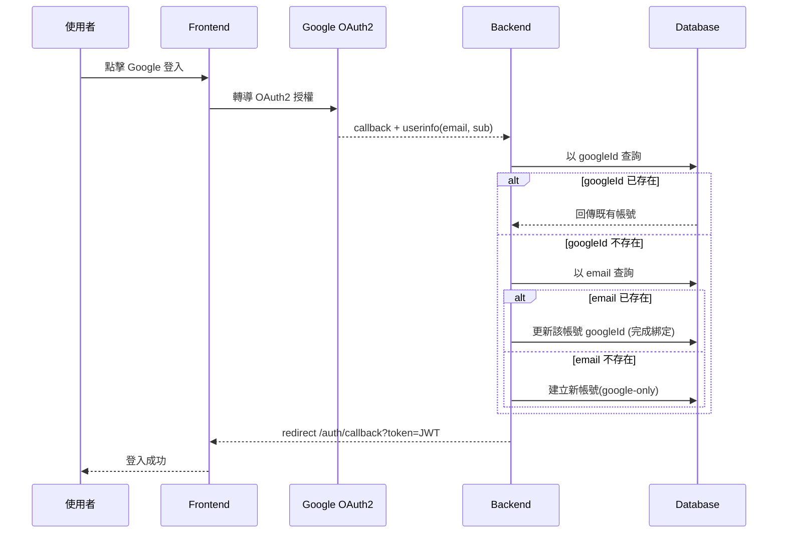
```mermaid
sequenceDiagram
    participant U as 使用者
    participant FE as Frontend
    participant GO as Google OAuth2
    participant BE as Backend
    participant DB as Database

    U->>FE: 點擊 Google 登入
    FE->>GO: 轉導 OAuth2 授權
    GO-->>BE: callback + userinfo(email, sub)
    BE->>DB: 以 googleId 查詢
    alt googleId 已存在
        DB-->>BE: 回傳既有帳號
    else googleId 不存在
        BE->>DB: 以 email 查詢
        alt email 已存在
            BE->>DB: 更新該帳號 googleId (完成綁定)
        else email 不存在
            BE->>DB: 建立新帳號(google-only)
        end
    end
    BE-->>FE: redirect /auth/callback?token=JWT
    FE-->>U: 登入成功
```

### 16.7 流程圖（Email 註冊/登入）
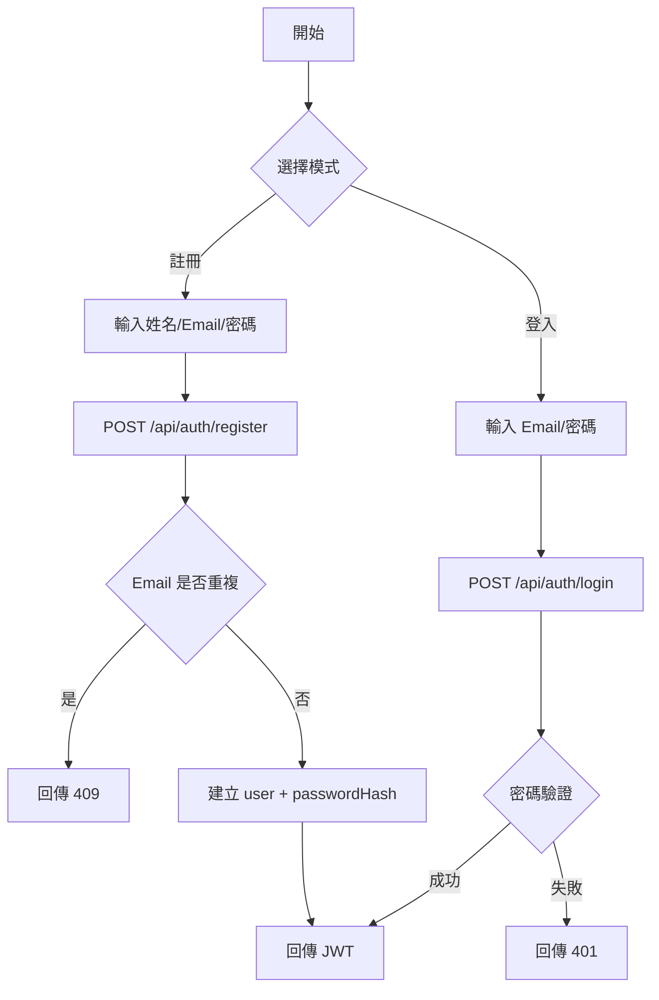
```mermaid
flowchart TD
    A[開始] --> B{選擇模式}
    B -->|註冊| C[輸入姓名/Email/密碼]
    C --> D[POST /api/auth/register]
    D --> E{Email 是否重複}
    E -->|是| F[回傳 409]
    E -->|否| G[建立 user + passwordHash]
    G --> H[回傳 JWT]

    B -->|登入| I[輸入 Email/密碼]
    I --> J[POST /api/auth/login]
    J --> K{密碼驗證}
    K -->|失敗| L[回傳 401]
    K -->|成功| H
```

### 16.8 狀態圖（帳號綁定狀態）
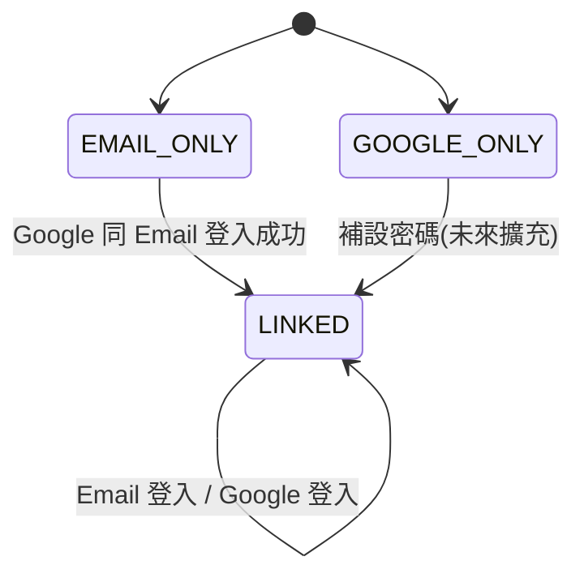
```mermaid
stateDiagram-v2
    [*] --> EMAIL_ONLY
    [*] --> GOOGLE_ONLY
    EMAIL_ONLY --> LINKED: Google 同 Email 登入成功
    GOOGLE_ONLY --> LINKED: 補設密碼(未來擴充)
    LINKED --> LINKED: Email 登入 / Google 登入
```

### 17. 主要環境資料庫設定更新（2026-03-05）
- `application.yml` 主環境資料庫由 H2 切換為 PostgreSQL。
- 舊 H2 datasource、H2 console 與 H2 dialect 設定以註解保留，便於後續回溯。
- PostgreSQL 連線改為環境變數驅動，預設值如下：
  - `DB_HOST=postgresql`
  - `DB_PORT=5432`
  - `DB_NAME=exam_system`
  - `DB_USERNAME=exam_user`
  - `DB_PASSWORD=exam_password`

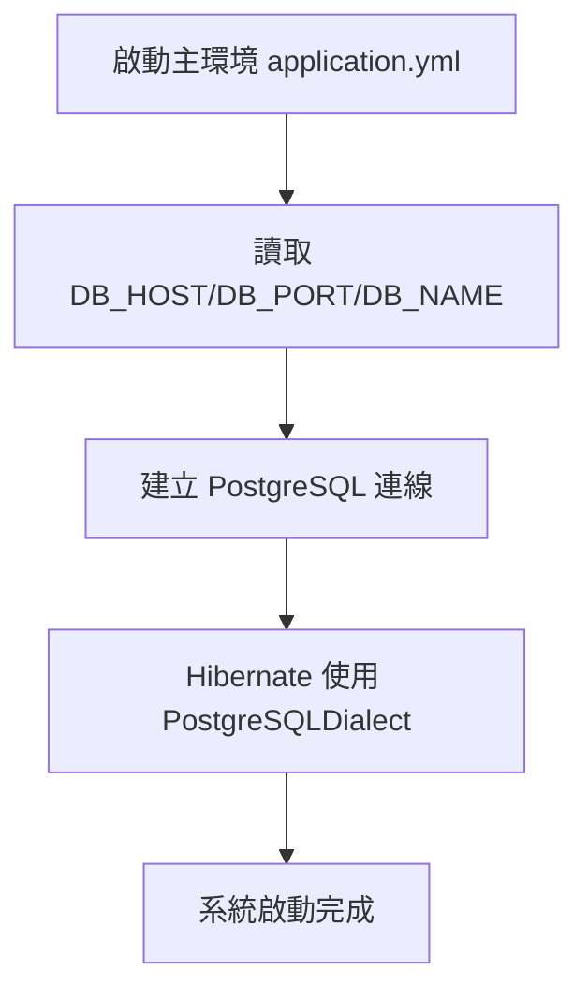
```mermaid
flowchart TD
    A[啟動主環境 application.yml] --> B[讀取 DB_HOST/DB_PORT/DB_NAME]
    B --> C[建立 PostgreSQL 連線]
    C --> D[Hibernate 使用 PostgreSQLDialect]
    D --> E[系統啟動完成]
```

### 18. Gateway WebSocket 轉發修正（2026-03-05）
- `nginx` gateway 需將 `/ws` 與 `/api`、`/oauth2` 同樣轉發到 backend。
- 若 `/ws` 未轉發，前端 SockJS 會收到 HTML（`text/html`）而非事件流，導致 `websocket/eventsource` 連線失敗。

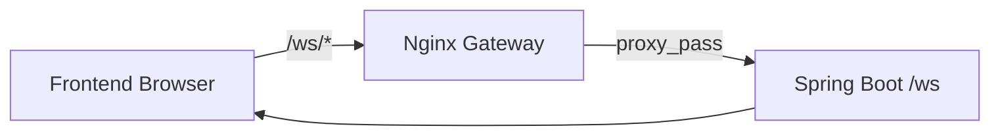
```mermaid
flowchart LR
    FE[Frontend Browser] -->|/ws/*| GW[Nginx Gateway]
    GW -->|proxy_pass| BE[Spring Boot /ws]
    BE --> FE
```

### 19. Frontend WebSocket Endpoint 解析規則（2026-03-05）
- 生產環境優先順序：
  1. `VITE_WS_ENDPOINT`
  2. `VITE_API_BASE_URL + /ws`
  3. `window.location.host + /ws`（最後 fallback）
- 目的：避免部署平台未正確注入 `VITE_WS_ENDPOINT` 時，前端誤連到前端網域 `/ws`。

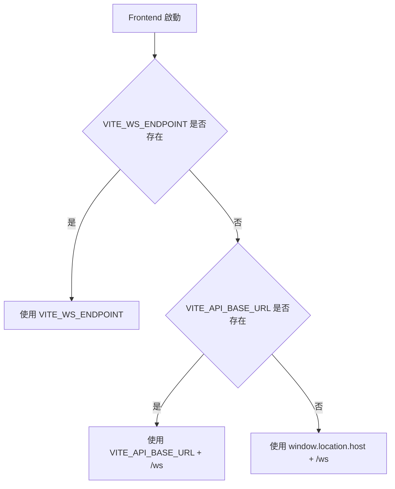
```mermaid
flowchart TD
    A[Frontend 啟動] --> B{VITE_WS_ENDPOINT 是否存在}
    B -->|是| C[使用 VITE_WS_ENDPOINT]
    B -->|否| D{VITE_API_BASE_URL 是否存在}
    D -->|是| E[使用 VITE_API_BASE_URL + /ws]
    D -->|否| F[使用 window.location.host + /ws]
```

### 20. Frontend WS 部署診斷輸出（2026-03-05）
- 前端啟動時需輸出以下診斷資訊：
  - `VITE_WS_ENDPOINT`
  - `VITE_API_BASE_URL`
  - 最終採用的 `WS_ENDPOINT`
  - endpoint 來源（`VITE_WS_ENDPOINT` / `VITE_API_BASE_URL` / `WINDOW_HOST` / `DEV_DEFAULT`）
- 用途：確認 Zeabur 已部署新 build，避免誤判為程式邏輯問題。

### 21. 學員端時間到顯示正確答案（2026-03-06）
- 講師端在題目時間到時，會呼叫 `PUT /api/exams/{examId}/questions/{questionId}/complete`。
- 後端透過 `/topic/exam/{examId}/statistics/question/{questionId}` 推送 `STATISTICS_UPDATED`：
  - 答題期間：`optionStatistics[].isCorrect = null`、`correctRate = null`
  - 時間到後：`optionStatistics[].isCorrect` 與 `correctRate` 會帶入實際值
- 學員端需訂閱當前題目的統計 Topic，當收到含 `isCorrect` 的資料後，立即切換選項顯示為結果模式（標示正確/錯誤答案）。

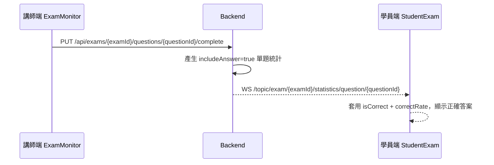
```mermaid
sequenceDiagram
    participant I as 講師端 ExamMonitor
    participant BE as Backend
    participant S as 學員端 StudentExam

    I->>BE: PUT /api/exams/{examId}/questions/{questionId}/complete
    BE->>BE: 產生 includeAnswer=true 單題統計
    BE-->>S: WS /topic/exam/{examId}/statistics/question/{questionId}
    S-->>S: 套用 isCorrect + correctRate，顯示正確答案
```

### 22. 講師端開測前統計展示（含地點統計）（2026-03-06）
- 講師頁 `ExamMonitor` 新增「開測前統計」畫面，作為推送第一題前的展示頁。
- 統計畫面至少包含：
  - 地區統計圖表（縣市分布，人數與比例）
  - 每個問券欄位（survey field）的統計圖表
- 推送第一題前，講師需先完成「已展示統計」確認；確認前不得開始作答流程。
- 地點統計資料來源為 `GET /api/locations/statistics/{examId}`，前端在以下時機更新：
  - 頁面初次載入
  - 收到學員加入 WebSocket 事件後

```mermaid
flowchart TD
    A[講師啟動測驗] --> B[開測前統計畫面]
    B --> C[GET /api/statistics/exams/{examId}/survey-fields]
    B --> D[GET /api/locations/statistics/{examId}]
    C --> E[渲染每個問券欄位圖表]
    D --> F[渲染地區圖表]
    G[WebSocket: STUDENT_JOINED] --> C
    G --> D
    B --> H{已展示統計?}
    H -->|否| I[禁止推送第一題]
    H -->|是| J[允許開始作答]
```

### 23. 講師/學員測驗頁日夜模式（2026-03-06）
- 講師 `ExamMonitor` 與學員 `StudentExam` 皆需提供可見的日夜模式切換按鈕。
- 兩頁主要畫面容器（頁面背景、卡片背景、主要文字）需跟隨 `themeStore.mode` 即時切換。
- 主題偏好使用前端既有 `theme-storage` 持久化；每位使用者在自己的瀏覽器可獨立保存偏好。

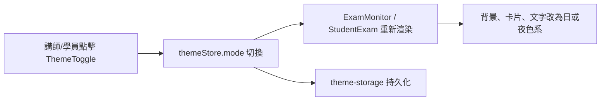
```mermaid
flowchart LR
    A[講師/學員點擊 ThemeToggle] --> B[themeStore.mode 切換]
    B --> C[ExamMonitor / StudentExam 重新渲染]
    C --> D[背景、卡片、文字改為日或夜色系]
    B --> E[theme-storage 持久化]
```

### 24. 移除登入頁訪客模式（2026-03-06）
- `LoginPage` 不再提供「以訪客模式繼續」按鈕。
- 登入入口統一為：
  - Email 註冊 / 登入
  - Google OAuth2 登入
- 未登入使用者若嘗試進入受保護頁面，仍維持導向 `/login` 的既有流程。

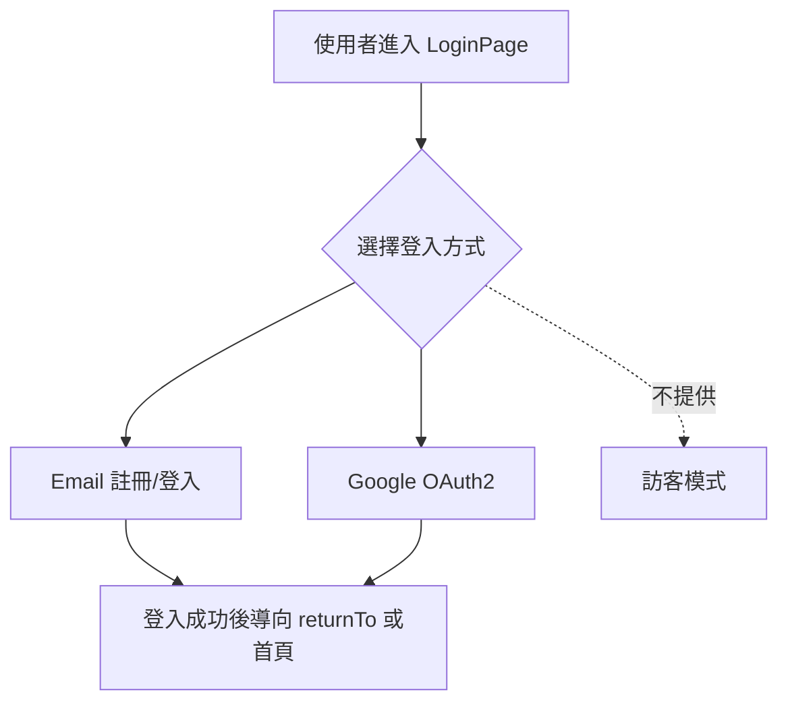
```mermaid
flowchart TD
    A[使用者進入 LoginPage] --> B{選擇登入方式}
    B --> C[Email 註冊/登入]
    B --> D[Google OAuth2]
    C --> E[登入成功後導向 returnTo 或首頁]
    D --> E
    B -. 不提供 .-> F[訪客模式]
```

### 25. 前端建置依賴補齊：prop-types（2026-03-06）
- 前端使用 `react-simple-maps`，其 ESM 輸出會引用 `prop-types`。
- 生產建置時若 `prop-types` 未安裝，Vite/Rollup 會出現 `failed to resolve import "prop-types"`。
- 解法：在 `exam-system-frontend` 安裝 `prop-types` 為正式依賴（`dependencies`），確保 build 環境可正確解析。

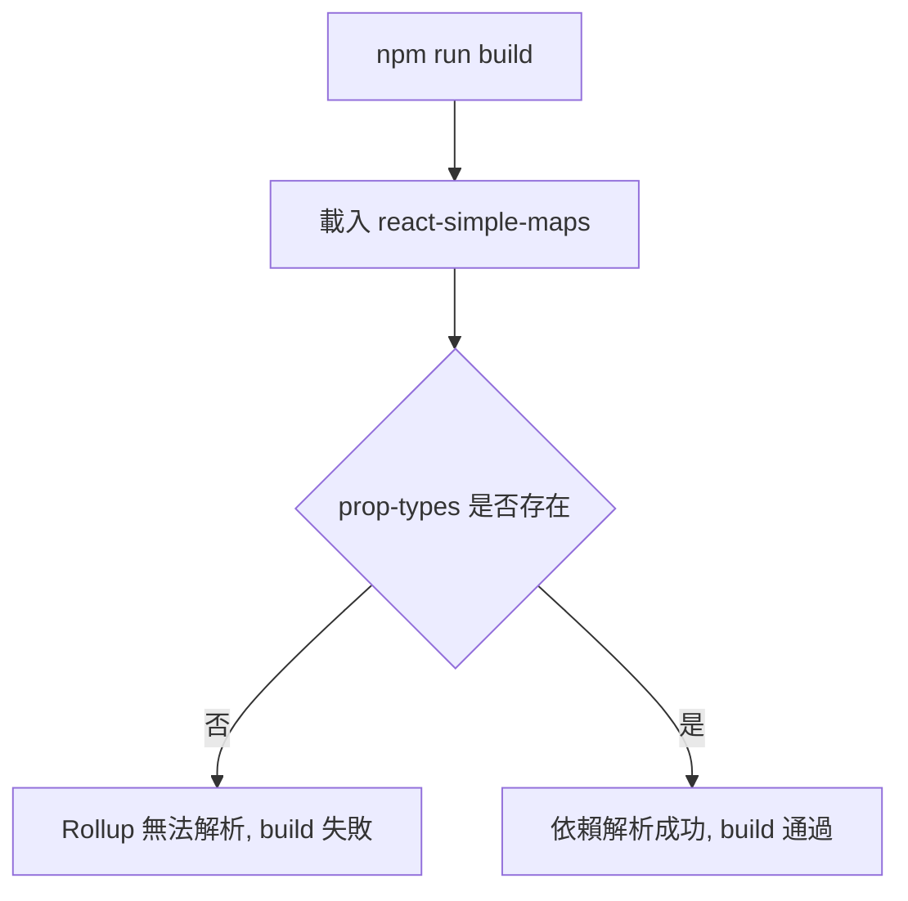
```mermaid
flowchart TD
    A[npm run build] --> B[載入 react-simple-maps]
    B --> C{prop-types 是否存在}
    C -->|否| D[Rollup 無法解析, build 失敗]
    C -->|是| E[依賴解析成功, build 通過]
```

### 26. 測驗入口等待與地點統計修正（2026-03-06）
- 講師進入 `ExamMonitor` 時，預設頁籤應停留在「學員資訊」，不主動切換到「開測前統計」。
- 「開測前統計」仍保留作為開始第一題前的檢視與確認流程，但需由講師自行切換或在按下開始時引導。
- 學員地點（`location`）定義為加入測驗必填資料：
  - 前端 `StudentJoin` 表單驗證必須要求選擇地區。
  - 後端 `joinExam` 必須驗證並儲存地點代碼到 `Student.location`。
- 地點統計（`GET /api/locations/statistics/{examId}`）以 `Student.location` 為來源統計，講師學員資訊頁可即時看到地區分布。

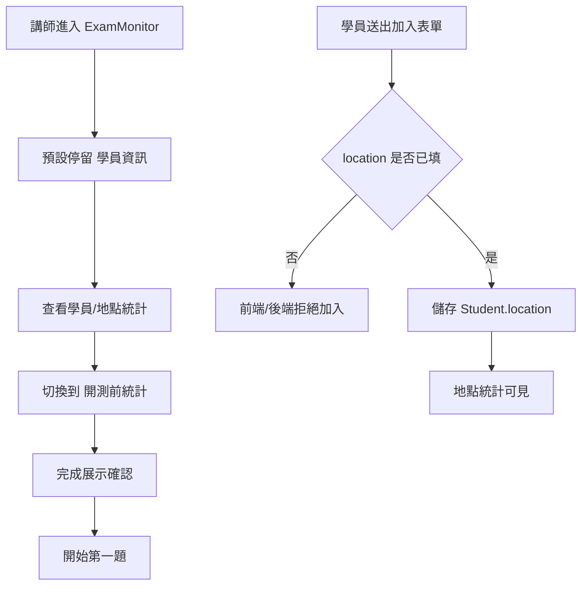
```mermaid
flowchart TD
    A[講師進入 ExamMonitor] --> B[預設停留 學員資訊]
    B --> C[查看學員/地點統計]
    C --> D[切換到 開測前統計]
    D --> E[完成展示確認]
    E --> F[開始第一題]

    G[學員送出加入表單] --> H{location 是否已填}
    H -->|否| I[前端/後端拒絕加入]
    H -->|是| J[儲存 Student.location]
    J --> K[地點統計可見]
```

### 27. V2 規劃總覽（2026-03-07）
- V2 目標是在**保留既有即時測驗流程**的前提下，新增「題庫 / 模板 / 測驗擁有權 / 作答歷史」能力。
- 最小改動原則如下：
  - 保留既有 `Exam`、`Question`、`QuestionOption`、`Student`、`Answer` 作為**單次測驗執行與結果快照**。
  - 新增題庫與模板層，避免每次複製整份測驗才能重複開考。
  - 以 `ownerUserId` 與 `ADMIN` bypass 實作資料存取隔離。
  - 保留既有 WebSocket 與即時作答流程，降低前後端重寫成本。

#### 27.1 架構與選型
- `Exam` 沿用：代表一次實際開測的場次（Exam Run）。
- `Question` / `QuestionOption` 沿用：代表開測當下複製下來的題目快照，確保歷史成績不受後續題庫修改影響。
- 新增 `QuestionBankItem` / `QuestionBankOption`：儲存講師私有題與公開題。
- 新增 `ExamTemplate` / `ExamTemplateQuestion`：將題庫題目組成可重複開測的模板。
- `Student` 新增 `userId`（nullable）：保留現有 session 流程，同時支援學生查詢跨講師歷史。
- `Exam` 新增 `ownerUserId`、`sourceTemplateId`：支援講師隔離、結果存取控制、追溯來源模板。

#### 27.2 資料模型
**沿用並擴充的實體**

| 實體 | V2 角色 | 主要新增欄位 |
|------|---------|--------------|
| `Exam` | 單次測驗執行 / 結果容器 | `ownerUserId`, `sourceTemplateId` |
| `Question` | 場次題目快照 | 無必改欄位，沿用既有設計 |
| `Student` | 場次參與者 | `userId`（nullable） |
| `Answer` | 場次作答記錄 | 無必改欄位，沿用既有設計 |

**新增實體**

| 實體 | 用途 | 關鍵欄位 |
|------|------|----------|
| `QuestionBankItem` | 講師題庫單題 | `ownerUserId`, `visibility`, `questionText`, `correctOptionOrder` |
| `QuestionBankOption` | 題庫選項 | `questionBankItemId`, `optionOrder`, `optionText` |
| `ExamTemplate` | 可重複開測的題組 | `ownerUserId`, `visibility`, `title`, `description`, `questionTimeLimit` |
| `ExamTemplateQuestion` | 模板與題庫題目的關聯 | `templateId`, `questionBankItemId`, `questionOrder`, `exportable`, `singleStatChartType`, `cumulativeChartType` |

#### 27.3 關鍵流程
1. 講師建立題庫題目，預設為私有，可切換為 `PUBLIC`。
2. 講師從自己的題庫題與可讀取的公開題建立 `ExamTemplate`。
3. 講師從模板發起一次新的 `Exam` 場次。
4. 系統將模板題目快照複製到既有 `Question` / `QuestionOption`，後續即時作答仍沿用既有流程。
5. 結果查詢以 `Exam.ownerUserId` 限制講師只能看自己的資料，`ADMIN` 可看全部。
6. 學生若已登入，加入測驗時將 `Student.userId` 寫入，供跨講師歷史查詢。

#### 27.4 虛擬碼
```java
// 從模板建立單次測驗場次（沿用既有 Exam 作為 run）
public ExamDTO launchExamFromTemplate(Long templateId, Long currentUserId) {
    ExamTemplate template = templateRepository.findOwnedOrPublic(templateId, currentUserId);

    Exam exam = Exam.builder()
        .title(template.getTitle())
        .description(template.getDescription())
        .questionTimeLimit(template.getQuestionTimeLimit())
        .ownerUserId(currentUserId)
        .sourceTemplateId(template.getId())
        .status(ExamStatus.CREATED)
        .build();

    exam = examRepository.save(exam);

    for (ExamTemplateQuestion templateQuestion : template.getQuestions()) {
        Question question = copyTemplateQuestionToExam(templateQuestion, exam);
        exam.addQuestion(question);
    }

    return convertToDTO(examRepository.save(exam));
}
```

#### 27.5 系統脈絡圖（V2）
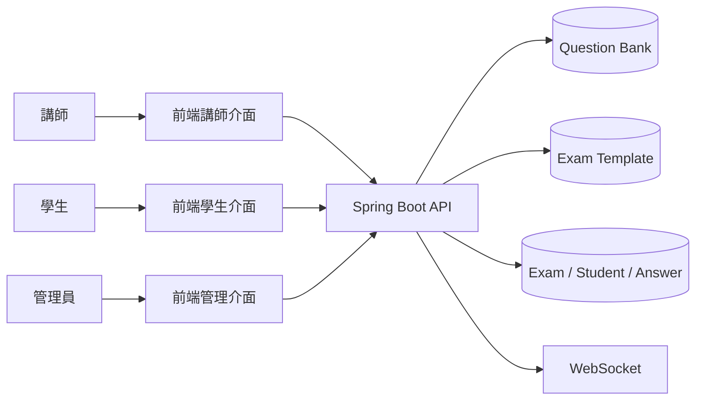
```mermaid
flowchart LR
    Instructor[講師] --> FE[前端講師介面]
    Student[學生] --> SFE[前端學生介面]
    Admin[管理員] --> AFE[前端管理介面]

    FE --> API[Spring Boot API]
    SFE --> API
    AFE --> API

    API --> QB[(Question Bank)]
    API --> TP[(Exam Template)]
    API --> RUN[(Exam / Student / Answer)]
    API --> WS[WebSocket]
```

#### 27.6 容器/部署概觀（V2）
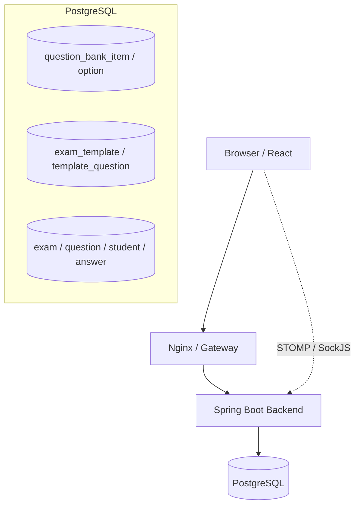
```mermaid
flowchart TB
    Browser[Browser / React] --> Gateway[Nginx / Gateway]
    Gateway --> Backend[Spring Boot Backend]
    Backend --> Postgres[(PostgreSQL)]
    Browser -. STOMP / SockJS .-> Backend

    subgraph PostgreSQL
        QB[(question_bank_item / option)]
        TP[(exam_template / template_question)]
        RUN[(exam / question / student / answer)]
    end
```

#### 27.7 模組關係圖（V2）
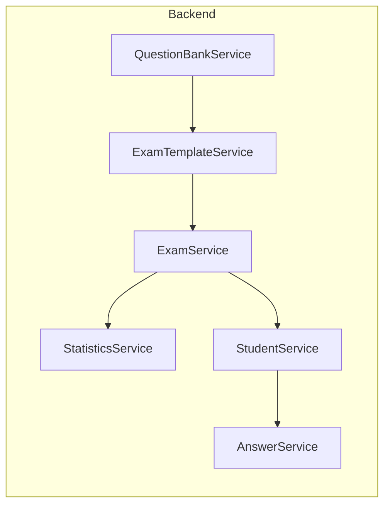
```mermaid
flowchart LR
    subgraph Backend
        QBS[QuestionBankService]
        ETS[ExamTemplateService]
        ES[ExamService]
        SS[StudentService]
        AS[AnswerService]
        STS[StatisticsService]
    end

    QBS --> ETS
    ETS --> ES
    ES --> STS
    ES --> SS
    SS --> AS
```

#### 27.8 序列圖（V2：模板開測）
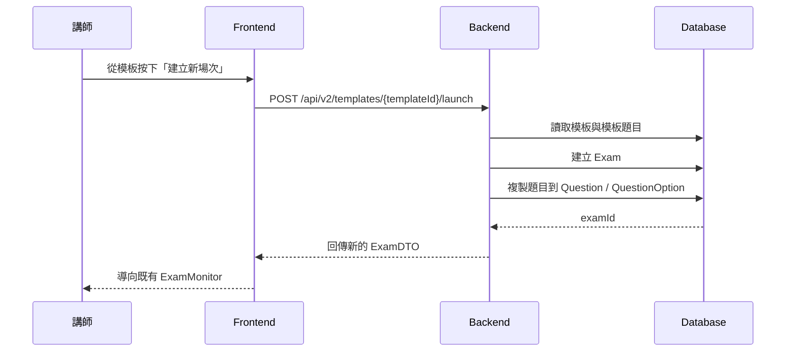
```mermaid
sequenceDiagram
    participant I as 講師
    participant FE as Frontend
    participant BE as Backend
    participant DB as Database

    I->>FE: 從模板按下「建立新場次」
    FE->>BE: POST /api/v2/templates/{templateId}/launch
    BE->>DB: 讀取模板與模板題目
    BE->>DB: 建立 Exam
    BE->>DB: 複製題目到 Question / QuestionOption
    DB-->>BE: examId
    BE-->>FE: 回傳新的 ExamDTO
    FE-->>I: 導向既有 ExamMonitor
```

#### 27.9 ER 圖（V2）
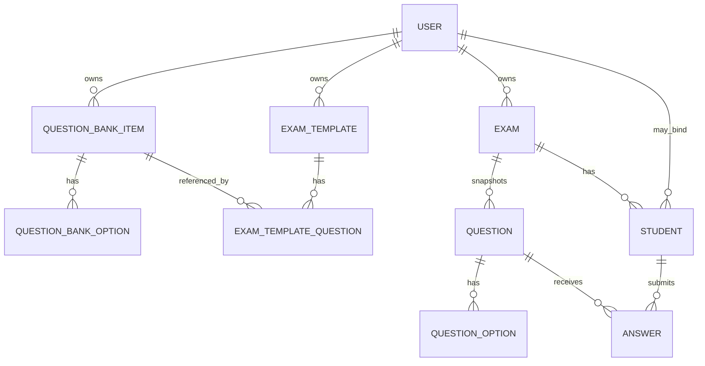
```mermaid
erDiagram
    USER ||--o{ QUESTION_BANK_ITEM : owns
    USER ||--o{ EXAM_TEMPLATE : owns
    USER ||--o{ EXAM : owns
    USER ||--o{ STUDENT : may_bind

    QUESTION_BANK_ITEM ||--o{ QUESTION_BANK_OPTION : has
    EXAM_TEMPLATE ||--o{ EXAM_TEMPLATE_QUESTION : has
    QUESTION_BANK_ITEM ||--o{ EXAM_TEMPLATE_QUESTION : referenced_by

    EXAM ||--o{ QUESTION : snapshots
    EXAM ||--o{ STUDENT : has
    QUESTION ||--o{ QUESTION_OPTION : has
    STUDENT ||--o{ ANSWER : submits
    QUESTION ||--o{ ANSWER : receives
```

#### 27.10 類別圖（V2）
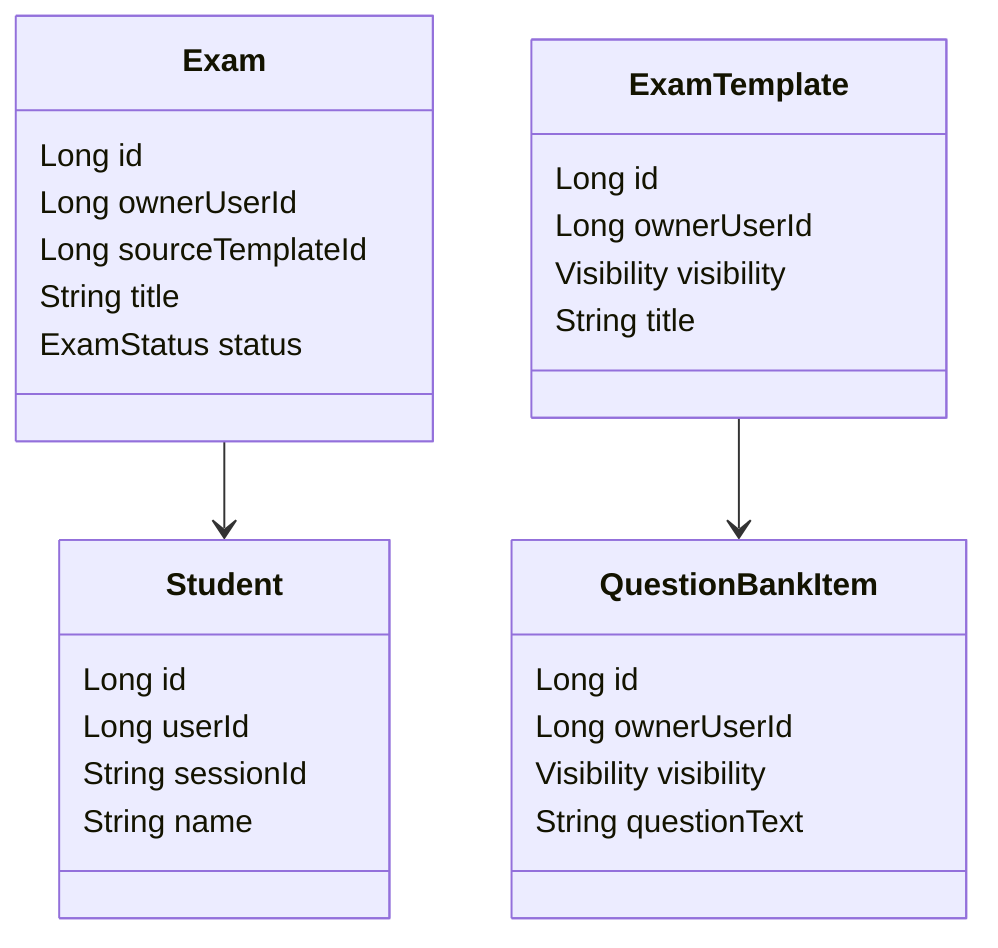
```mermaid
classDiagram
    class Exam {
        Long id
        Long ownerUserId
        Long sourceTemplateId
        String title
        ExamStatus status
    }

    class QuestionBankItem {
        Long id
        Long ownerUserId
        Visibility visibility
        String questionText
    }

    class ExamTemplate {
        Long id
        Long ownerUserId
        Visibility visibility
        String title
    }

    class Student {
        Long id
        Long userId
        String sessionId
        String name
    }

    ExamTemplate --> QuestionBankItem
    Exam --> Student
```

#### 27.11 流程圖（V2：權限判斷）
```mermaid
flowchart TD
    A[使用者請求題庫 / 模板 / 結果] --> B{角色是否 ADMIN}
    B -->|是| C[允許查看全部]
    B -->|否| D{資源 ownerUserId == currentUserId}
    D -->|是| E[允許讀寫]
    D -->|否| F{資源是否 PUBLIC 且為唯讀資源}
    F -->|是| G[允許讀取]
    F -->|否| H[拒絕 403]
```

#### 27.12 狀態圖（V2：題庫 / 模板 / 場次）
```mermaid
stateDiagram-v2
    [*] --> QuestionPrivate
    QuestionPrivate --> QuestionPublic : 講師公開
    QuestionPublic --> QuestionPrivate : 講師取消公開

    [*] --> TemplateDraft
    TemplateDraft --> TemplateReady : 題目完整
    TemplateReady --> ExamCreated : 發起新場次

    ExamCreated --> ExamStarted : 啟動測驗
    ExamStarted --> ExamEnded : 結束測驗
```

### 28. V2 對既有架構的最小改動策略（2026-03-07）
- **保留不動**
  - `ExamMonitor`、`StudentJoin`、`StudentExam` 主要即時流程。
  - `Exam`、`Question`、`QuestionOption`、`Student`、`Answer` 的場次角色。
  - `StatisticsService` 以 `examId` 為中心的聚合邏輯。
- **必須新增**
  - 題庫與模板資料表、Repository、Service、Controller。
  - `Exam.ownerUserId`、`Exam.sourceTemplateId`、`Student.userId`。
  - 題庫可見性與結果授權檢查。
- **前端最小調整**
  - 既有 `InstructorDashboard` 保留作為「我的測驗場次」入口。
  - 新增「題庫管理」與「模板管理」頁，不強迫重寫既有 `ExamMonitor`。
  - `ExamCreator` 在 V2 可逐步轉型為模板編輯頁。

### 29. Google OAuth2 Callback 防重處理（2026-03-07）
- 前端 `AuthCallback` 頁面在開發模式受 React `StrictMode` 影響，`useEffect` 可能被額外執行一次。
- Callback 若重複處理同一個 token，可能導致：
  - `sessionStorage.returnTo` 被第一次流程清除後，第二次流程 fallback 到 `/`
  - 使用者感知為「首次登入需要操作兩次」
- 規範如下：
  - `AuthCallback` 必須對同一次 callback 僅消費 token 一次。
  - 導頁計時器需在 effect cleanup 時清除，避免重複跳轉。
  - 此修正不改變後端 OAuth2/JWT 合約，屬前端認證流程穩定性修正。

```mermaid
sequenceDiagram
    participant U as 使用者
    participant FE as AuthCallback
    participant ST as sessionStorage

    U->>FE: /auth/callback?token=JWT
    FE->>FE: 檢查是否已處理 callback
    alt 尚未處理
        FE->>ST: 讀取 returnTo
        FE->>ST: 清除 returnTo
        FE-->>U: 導向原頁或首頁
    else 已處理
        FE-->>U: 忽略重複 effect
    end
```

### 29.1 Google OAuth 首次建帳後需直接登入並返回原頁（2026-03-09）
- 學員端與登入頁皆可透過 `GET /oauth2/authorization/google` 發起 Google OAuth2。
- 若為首次使用 Google 登入，後端在建立新 `User` 後，必須於同一次 OAuth callback 直接簽發 JWT，前端不得要求使用者再次點擊登入。
- 為避免首次建帳後跳回首頁而中斷原流程，OAuth 發起端若帶有 `state`（例如學員加入頁的原始 URL），後端成功回呼後需將該 `state` 一併帶到前端 `/auth/callback`。
- 前端 `AuthCallback` 導頁優先序：
  1. callback querystring 的 `state`
  2. `sessionStorage.returnTo`
  3. `/`
- 目標：
  - 第一次 Google 登入建立帳號後立即成為已登入狀態。
  - 若從 `StudentJoin` 發起 OAuth，登入完成後直接回到原本的加入頁，沿用已取得的登入資訊繼續加入流程。

```mermaid
sequenceDiagram
    participant U as 使用者
    participant SJ as StudentJoin / LoginPage
    participant BE as Backend OAuth2
    participant CB as AuthCallback

    U->>SJ: 點擊 Google 登入
    SJ->>BE: /oauth2/authorization/google?state=原頁URL
    BE-->>BE: 首次登入則建立 User
    BE-->>CB: /auth/callback?token=JWT&state=原頁URL
    CB-->>CB: 寫入前端登入態
    CB-->>SJ: 導回 state 指向頁面
```

### 30. 學員地區選擇擴充（2026-03-07）
- 學員加入頁 `StudentJoin` 的地區選擇維持台灣地圖為主要入口，但需補強手機操作體驗與海外地區支援。
- 地圖互動規則：
  - 限制平移範圍，避免手機拖曳時地圖大幅跑出視窗。
  - 降低可縮放自由度，避免小螢幕誤操作導致選取困難。
- 地區資料規則：
  - 台灣地區仍以既有縣市代碼儲存。
  - 新增海外快速選項：`香港`、`澳門`、`大陸`、`新加坡`、`美國`。
  - 新增 `其他` 選項；當選擇 `其他` 時，必須輸入自訂地區文字。
- 最小改動策略：
  - 既有 `Student.location` 欄位沿用。
  - 海外固定選項以固定代碼儲存。
  - `其他` 以 `OTHER:自訂文字` 形式儲存，避免新增資料表欄位。
  - 講師端地區統計仍沿用 `GET /api/locations/statistics/{examId}`，後端負責將代碼轉回顯示名稱。

```mermaid
flowchart TD
    A[學員進入 StudentJoin] --> B{選擇台灣或海外}
    B -->|台灣| C[於地圖點選縣市]
    B -->|海外固定選項| D[選擇 香港/澳門/大陸/新加坡/美國]
    B -->|其他| E[輸入自訂地區]
    E --> F{是否已填自訂文字}
    F -->|否| G[不可送出]
    F -->|是| H[儲存 OTHER:自訂文字]
    C --> I[送出 location code]
    D --> I
    H --> I
```

### 31. 學員答題頁桌機版型優化（2026-03-07）
- `StudentExam` 維持手機優先，但不可在大螢幕仍固定為狹窄手機欄寬。
- 響應式規範：
  - 手機維持單欄直向堆疊。
  - 平板可維持單欄，但容器寬度需略放大。
  - 桌機（約 `>= 1024px`）改為寬版配置，至少包含：
    - 左側主題目區：題號、題幹、選項、提交動作。
    - 右側資訊區：學生資訊、測驗狀態、連線狀態、倒數計時或作答提示。
- 視覺目標：
  - 題幹區與選項區在桌機有更大的可閱讀寬度。
  - 重要即時資訊不再全部擠在上方單列，而是可於側欄持續顯示。
  - 手機版互動流程與按鈕尺寸不可因桌機優化而退化。

```mermaid
flowchart TD
    A[進入 StudentExam] --> B{螢幕寬度}
    B -->|手機| C[單欄垂直排版]
    B -->|平板| D[單欄寬版排版]
    B -->|桌機| E[主內容區 + 側欄雙欄排版]
    E --> F[左側顯示題目與選項]
    E --> G[右側顯示學生與測驗狀態]
```

### 32. 專案技能（Project Skill）納入版本控管（2026-03-07）
- 為降低 AI 代理在本專案中重複探索目錄、流程與測試命令的成本，新增 repo 內專案技能。
- 技能目的：
  - 提供此專案的固定開發順序與重要限制。
  - 指引 AI 在前端、後端、文件、測試與發布時採用一致流程。
  - 讓技能內容隨 Git 一同版本化，避免只存在使用者本機設定。
- 技能內容範圍：
  - 專案結構與主要目錄。
  - 文件優先、任務拆分、測試驗證、發布前檢查。
  - Windows / PowerShell / Java 版本等環境前提。
- 技能設計原則：
  - `SKILL.md` 保持精簡，只放工作流程與判斷準則。
  - 細節性專案脈絡放於 `references/`，避免重複複製 `spec.md` / `api.md` 大段內容。

```mermaid
flowchart TD
    A[AI 代理接手專案任務] --> B[讀取專案技能 SKILL.md]
    B --> C[依需要讀取 references/project-context.md]
    C --> D[先更新 spec/api/todolist]
    D --> E[實作與測試]
    E --> F[commit / push / 發布報告]
```

### 33. 測驗頁固定選單避讓與主題切換精簡（2026-03-07）
- 全站左上角固定導覽列不可遮擋講師與學員測驗頁的主要內容。
- 版面規則：
  - 共用頁面容器需對固定導覽列預留足夠上方安全距離。
  - 在桌機與手機下都需避免頁面標題、控制列、狀態列被左上導覽覆蓋。
- 主題切換規則：
  - 日夜模式切換按鈕僅保留共用 `PageLayout` 右上角的全域按鈕。
  - `ExamMonitor`、`StudentExam` 等頁面內不得再放置第二顆主題切換按鈕。
  - 狀態徽章、連線資訊等仍可保留在頁面內容區。

```mermaid
flowchart TD
    A[進入任一頁面] --> B[PageLayout 渲染固定左上導覽與右上 ThemeToggle]
    B --> C[內容區自動套用安全上邊距]
    C --> D{頁面是否為測驗頁}
    D -->|是| E[頁面內不再渲染額外 ThemeToggle]
    D -->|否| F[維持既有內容]
```

### 34. 講師問券/郵件功能開關（2026-03-07）
- `ADMIN` 可控制個別講師是否可進入：
  - 問券管理
  - 郵件管理
- 最小改動策略：
  - 沿用既有 `User`，新增兩個布林欄位：
    - `surveyManagementEnabled`
    - `emailManagementEnabled`
  - 預設值為 `true`，避免影響既有講師。
  - `ADMIN` 不受此功能旗標限制，永遠可進入。
- 行為規則：
  - 當講師的 `surveyManagementEnabled = false` 時：
    - 前端隱藏問券管理入口
    - 相關管理路由禁止進入
    - 後端問券管理 API 拒絕操作
  - 當講師的 `emailManagementEnabled = false` 時：
    - 前端隱藏郵件管理入口
    - 相關管理路由禁止進入
    - 後端郵件管理 API 拒絕操作
  - 公開問券填寫頁 `SurveyResponse` 不受此限制影響

```mermaid
flowchart TD
    A[講師登入] --> B[取得 UserDTO 功能旗標]
    B --> C{surveyManagementEnabled?}
    C -->|是| D[顯示問券管理入口]
    C -->|否| E[隱藏問券管理入口並封鎖管理路由]
    B --> F{emailManagementEnabled?}
    F -->|是| G[顯示郵件管理入口]
    F -->|否| H[隱藏郵件管理入口並封鎖管理路由]
    I[ADMIN 調整使用者功能開關] --> B
```

### 35. 使用者功能欄位 migration 相容性（2026-03-07）
- 本專案目前使用 PostgreSQL + Hibernate `ddl-auto=update`。
- 對既有資料表新增 `NOT NULL` 欄位時，若舊資料列尚無值，資料庫會拒絕 `ALTER TABLE ... ADD COLUMN ... NOT NULL`。
- 因此對 `users` 這類既有表新增布林功能欄位時，需遵循：
  - DDL 層提供資料庫預設值，例如 `boolean default true`
  - 再搭配應用層預設值，確保新舊資料都能相容
- 適用欄位：
  - `surveyManagementEnabled`
  - `emailManagementEnabled`

```mermaid
flowchart TD
    A[Hibernate update users 表] --> B[新增布林欄位]
    B --> C{欄位是否 NOT NULL 且無 DB default}
    C -->|是| D[PostgreSQL 因舊資料 null 而拒絕 migration]
    C -->|否| E[欄位成功建立]
    E --> F[後端正常啟動]
```

### 36. 固定左上選單安全區需覆蓋實際視覺高度（2026-03-07）
- 共用 `PageLayout` 的內容安全上邊距，必須以固定左上選單的實際視覺占用高度為準。
- 不可只用導覽列內文高度估算，還必須納入：
  - 固定定位的 `top` 偏移
  - 容器 `padding`
  - 圓角與陰影造成的實際遮擋感
- 響應式規則：
  - 桌機需提供較大的安全區，確保第一張卡片完整露出。
  - 手機需保留較小但仍足夠的安全區。

```mermaid
flowchart TD
    A[PageLayout 渲染固定左上選單] --> B[估算選單實際占用高度]
    B --> C[內容區套用對應安全上邊距]
    C --> D{首張卡片是否完整露出}
    D -->|否| E[提高安全區]
    D -->|是| F[通過]
```

### 37. 固定左上選單預設收合、滑鼠靠近展開（2026-03-07）
- 桌機版左上固定選單不可長時間以完整文字狀態佔據內容區。
- 互動規則：
  - 桌機預設為收合狀態，只顯示 icon 與最小寬度。
  - 當滑鼠移入或鍵盤 focus 進入選單時，展開顯示完整文字。
  - 手機與窄螢幕維持直接可操作的簡化樣式，不依賴 hover。
- 視覺目標：
  - 預設狀態減少遮擋感。
  - 展開狀態仍保有完整操作可見性。
  - 不影響首頁、系統管理、講師入口、登出的既有功能。

```mermaid
flowchart TD
    A[桌機載入 PageLayout] --> B[左上選單預設收合]
    B --> C{滑鼠移入或 focus?}
    C -->|是| D[展開文字與寬度]
    C -->|否| E[維持 icon-only]
```

### 38. 手機版固定選單預設收合、點擊展開（2026-03-07）
- 手機版沒有 hover，因此不可沿用桌機的 hover 展開模式。
- 互動規則：
  - 手機版左上固定選單預設為收合狀態。
  - 使用者點擊選單入口後才展開完整操作項目。
  - 再次點擊入口或完成操作後可回到收合狀態。
- 目標：
  - 降低固定選單對學員頁首張卡片與狀態列的遮擋。
  - 保留首頁、系統管理、講師入口、登出的操作可達性。

```mermaid
flowchart TD
    A[手機載入 PageLayout] --> B[固定選單預設收合]
    B --> C{使用者點擊選單入口?}
    C -->|是| D[展開完整選單]
    C -->|否| E[維持收合]
    D --> F{再次點擊或完成導頁?}
    F -->|是| B
```

---

**文件版本**：v2.0-draft
**最後更新**：2026-03-07
