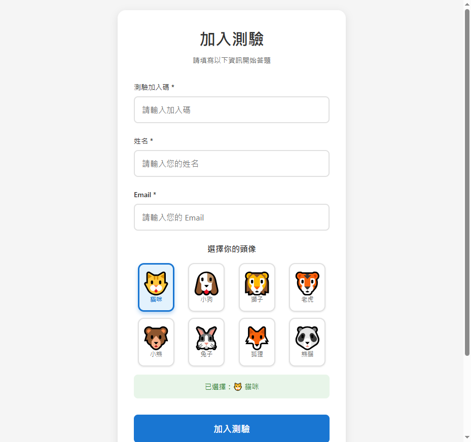
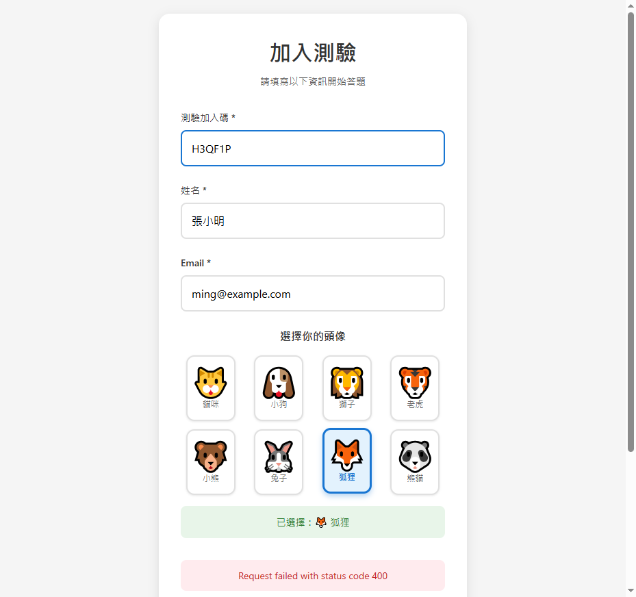
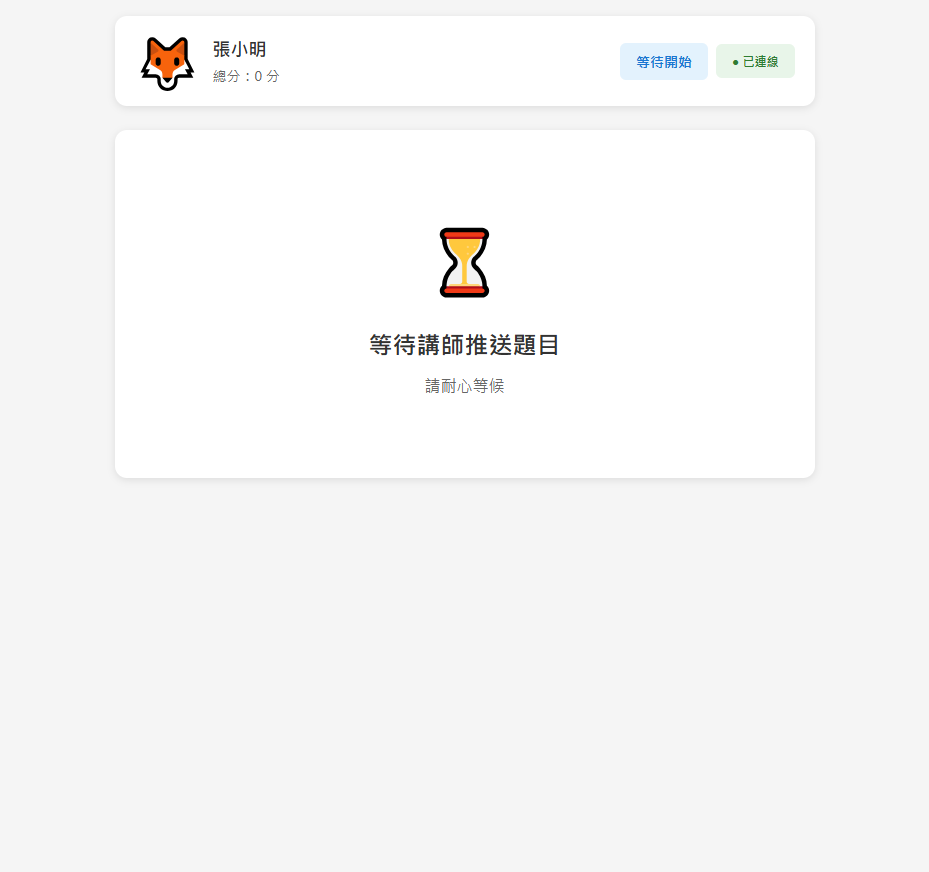
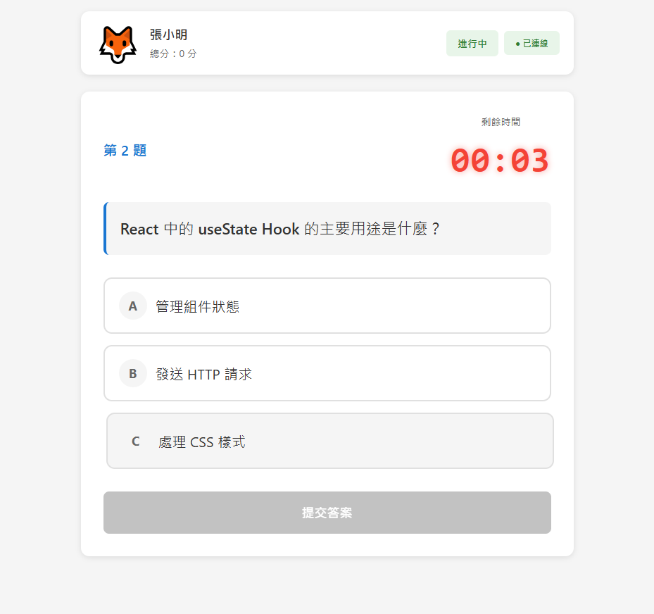
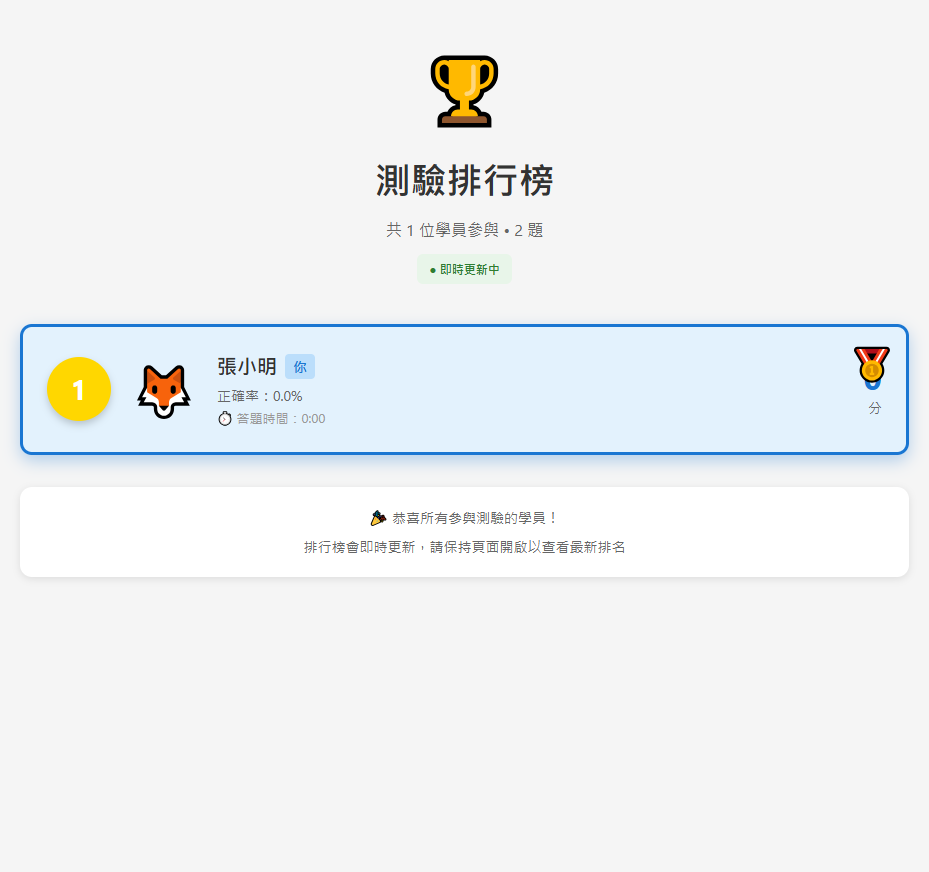

# 即時互動測驗統計系統 - 學員端操作 SOP

**版本**: v1.0
**最後更新**: 2025-10-05
**適用對象**: 測驗參與學員

---

## 目錄

1. [系統簡介](#1-系統簡介)
2. [加入測驗](#2-加入測驗)
3. [等待測驗開始](#3-等待測驗開始)
4. [接收題目與作答](#4-接收題目與作答)
5. [查看統計結果](#5-查看統計結果)
6. [查看排行榜](#6-查看排行榜)
7. [常見問題與注意事項](#7-常見問題與注意事項)

---

## 1. 系統簡介

### 1.1 系統概述

即時互動測驗統計系統讓您可以透過手機或電腦參與講師建立的即時測驗，並即時查看答題統計與排行榜。

### 1.2 核心功能

- ✅ 快速加入測驗（QR Code 或加入碼）
- ✅ 即時接收題目
- ✅ 倒數計時作答
- ✅ 即時查看答題統計
- ✅ 即時排行榜更新
- ✅ 個人化頭像顯示

### 1.3 系統入口

**學員入口**: `http://localhost:5173/student`

或掃描講師提供的 QR Code 直接進入

---

## 2. 加入測驗

### 2.1 取得加入碼

向講師取得以下其中一項：
- **QR Code**：由講師在投影螢幕上顯示
- **加入碼**：6 位英數字組合（例如：`H3QF1P`）

### 2.2 進入加入頁面

**方式一：掃描 QR Code**
1. 使用手機相機或掃碼 App 掃描講師螢幕上的 QR Code
2. 自動跳轉至學員加入頁面

**方式二：手動輸入網址**
1. 開啟瀏覽器
2. 前往 `http://localhost:5173/student`
3. 進入加入頁面


*圖 2-1：學員加入測驗頁面*

### 2.3 填寫註冊資訊

在加入頁面填寫以下必填資訊：

| 欄位名稱 | 說明 | 範例值 |
|---------|------|--------|
| **測驗加入碼** | 講師提供的 6 位加入碼 | `H3QF1P` |
| **姓名** | 您的真實姓名或暱稱 | `張小明` |
| **Email** | 您的電子郵件地址 | `ming@example.com` |
| **頭像** | 選擇一個代表您的頭像圖示 | 🦊 狐狸 |

#### 頭像選項：
系統提供 8 種可愛頭像供您選擇：
- 🐱 貓咪
- 🐶 小狗
- 🦁 獅子
- 🐯 老虎
- 🐻 小熊
- 🐰 兔子
- 🦊 狐狸
- 🐼 熊貓


*圖 2-2：填寫完整的加入表單*

### 2.4 提交加入

1. 確認所有資訊填寫正確
2. 點擊 **「加入測驗」** 按鈕
3. 系統會驗證加入碼並建立您的學員帳號
4. 加入成功後自動跳轉至等待頁面

> **重要提示**：
> - 加入碼必須正確，否則無法加入
> - 姓名與 Email 請填寫正確，方便講師識別
> - 選擇的頭像會在排行榜上顯示

---

## 3. 等待測驗開始

### 3.1 等待頁面說明

成功加入測驗後，會進入等待頁面：


*圖 3-1：等待講師推送題目*

### 3.2 等待頁面顯示資訊

在等待頁面可以看到：

- **您的頭像與姓名**：左上角顯示您選擇的頭像和姓名
- **目前總分**：顯示您的累積分數（初始為 0 分）
- **測驗狀態**：顯示「等待開始」
- **WebSocket 連線狀態**：● 已連線（綠色圓點）
- **等待訊息**：「⏳ 等待講師推送題目」

### 3.3 在等待期間

- ✅ **保持頁面開啟**：不要關閉或重新整理頁面
- ✅ **確認連線狀態**：確保顯示「● 已連線」
- ✅ **耐心等候**：講師會在適當時機推送題目
- ❌ **請勿重複加入**：重複加入會產生多筆學員記錄

> **提示**：
> - 講師會等待所有學員加入後才開始推送題目
> - 如果連線中斷（顯示紅色圓點），請重新整理頁面

---

## 4. 接收題目與作答

### 4.1 接收題目

當講師推送題目後：

1. 頁面會自動更新顯示題目內容
2. 倒數計時器開始倒數
3. 選項按鈕變為可點擊狀態


*圖 4-1：接收到題目並開始作答*

### 4.2 題目頁面說明

題目頁面顯示以下資訊：

#### 頂部資訊欄：
- **頭像與姓名**：左上角顯示
- **目前總分**：右上角顯示累積分數
- **測驗狀態**：顯示「進行中」
- **連線狀態**：● 已連線

#### 題目區域：
- **題目編號**：顯示「第 X 題」
- **倒數計時器**：顯示剩餘答題時間（例如：`00:11`）
- **題目內容**：完整的題目文字
- **選項按鈕**：A、B、C、D 等選項（依題目而定）
- **提交答案按鈕**：選擇選項後才能點擊

### 4.3 作答步驟

1. **閱讀題目**：仔細閱讀題目內容
2. **查看時間**：注意倒數計時器的剩餘時間
3. **選擇答案**：點擊您認為正確的選項按鈕
4. **提交答案**：點擊「提交答案」按鈕

#### 選擇答案時：
- 點擊選項按鈕後，該按鈕會變色（表示已選擇）
- 可以重新點擊其他選項來更改答案
- 「提交答案」按鈕會從灰色變為可點擊狀態

#### 提交答案後：
- 選項按鈕會變為不可點擊狀態
- 顯示「✅ 答案已提交」訊息
- 無法再更改答案

### 4.4 時間限制

- ⏰ **倒數計時**：每題都有固定的答題時間（由講師設定）
- ⏰ **時間到期**：倒數至 `00:00` 時，選項會自動鎖定
- ⏰ **未作答**：時間到仍未提交答案，該題視為未答

> **重要提示**：
> - 一旦提交答案就無法修改
> - 時間到期後無法再提交答案
> - 每題只能作答一次

---

## 5. 查看統計結果

### 5.1 統計顯示時機

當題目時間到期後，頁面會自動顯示答題統計：

- 選項按鈕變為不可點擊
- 顯示「⏰ 時間已到期」訊息
- 統計圖表自動出現在題目下方

### 5.2 統計內容

統計區域會顯示：

#### 📊 大家的答題統計

**圖表顯示**：
- **長條圖或圓餅圖**：依講師設定的圖表類型顯示
- **各選項分布**：顯示每個選項有多少人選擇
- **即時更新**：學員提交答案時即時更新

**統計數據**：
- **📝 總答題人數**：已提交答案的學員總數
- **✅ 正確率**：答對的學員百分比

### 5.3 個人作答結果

如果您有提交答案：
- ✅ **答對**：選項旁會顯示綠色勾選記號
- ❌ **答錯**：選項旁會顯示紅色叉叉
- **正確答案**：系統會標示哪個選項是正確答案

如果未作答：
- 顯示「未作答」或「時間已到，無法作答」訊息

> **提示**：
> - 統計結果會即時更新
> - 可以看到其他學員的答題分布
> - 正確答案會在時間到後顯示

---

## 6. 查看排行榜

### 6.1 排行榜顯示時機

測驗結束後，頁面會自動跳轉至排行榜頁面：


*圖 6-1：測驗排行榜頁面*

### 6.2 排行榜內容

#### 頂部資訊：
- **🏆 測驗排行榜**：頁面標題
- **參與人數**：共 X 位學員參與
- **題目總數**：共 Y 題
- **更新狀態**：● 即時更新中

#### 排名列表：

每位學員的排名卡片顯示：

| 欄位 | 說明 |
|-----|------|
| **排名**| 名次（1、2、3...） |
| **頭像** | 學員選擇的頭像圖示 |
| **姓名** | 學員姓名 |
| **個人標記** | 您自己的排名會標示「你」 |
| **正確率** | 答對題數的百分比 |
| **答題時間** | 總答題耗時（分:秒） |
| **總分** | 累積得分 |

#### 特殊標記：
- 🥇 **第一名**：金牌圖示
- 🥈 **第二名**：銀牌圖示
- 🥉 **第三名**：銅牌圖示

### 6.3 排行榜規則

**排名依據**：
1. **總分高者優先**：答對越多題，分數越高
2. **答題時間**：同分時，答題時間短者排名較前
3. **加入順序**：其他條件相同時，較早加入者排名較前

**分數計算**：
- ✅ 答對一題：+1 分
- ❌ 答錯或未答：0 分

### 6.4 排行榜更新

- **即時更新**：排行榜會持續更新
- **最終結果**：測驗結束後顯示最終排名
- **保持開啟**：建議保持頁面開啟以查看最新排名

> **提示**：
> - 您的排名會特別標示「你」方便識別
> - 前三名會有獎牌圖示
> - 可以截圖保存排行榜結果

---

## 7. 常見問題與注意事項

### 7.1 加入測驗相關

**Q1: 找不到加入碼怎麼辦？**
- A: 請向講師索取 6 位加入碼或掃描講師螢幕上的 QR Code

**Q2: 加入碼輸入錯誤怎麼辦？**
- A: 系統會顯示錯誤訊息「測驗不存在或已結束」，請確認加入碼是否正確

**Q3: 可以更改姓名或頭像嗎？**
- A: 加入後無法更改，請在加入前確認資訊正確

**Q4: Email 一定要填寫嗎？**
- A: 是的，Email 為必填欄位

### 7.2 作答相關

**Q5: 可以修改已提交的答案嗎？**
- A: 不可以，答案一旦提交就無法修改

**Q6: 時間到了還沒作答怎麼辦？**
- A: 該題會視為未答，無法獲得分數

**Q7: 網路中斷會影響作答嗎？**
- A: 會的，請確保網路連線穩定。如果斷線，請重新整理頁面

**Q8: 可以在多個裝置上同時登入嗎？**
- A: 不建議，可能會造成答題記錄混亂

### 7.3 技術相關

**Q9: WebSocket 顯示未連線怎麼辦？**
- A: 請重新整理頁面，如果問題持續請聯繫講師

**Q10: 頁面卡住不動怎麼辦？**
- A: 嘗試重新整理頁面（F5）

**Q11: 推薦使用哪種瀏覽器？**
- A: Chrome、Edge、Firefox、Safari（最新版本）

**Q12: 手機可以參加測驗嗎？**
- A: 可以，系統支援響應式設計

### 7.4 注意事項

#### 測驗前：
- ✅ 確保網路連線穩定
- ✅ 使用推薦的瀏覽器
- ✅ 準備好加入碼或 QR Code
- ✅ 選擇一個安靜的答題環境

#### 測驗中：
- ✅ 保持頁面開啟，不要關閉或切換
- ✅ 注意倒數計時器
- ✅ 仔細閱讀題目再作答
- ✅ 確認答案後再提交
- ❌ 不要重新整理頁面（除非連線中斷）

#### 測驗後：
- ✅ 可以截圖保存排行榜
- ✅ 可以分享您的成績
- ✅ 關閉頁面不會影響記錄

### 7.5 操作流程總覽

```
取得加入碼 → 進入加入頁面 → 填寫資訊 → 加入測驗 → 等待開始
→ 接收題目 → 選擇答案 → 提交答案 → 查看統計 → 等待下一題
→ ... → 查看排行榜
```

### 7.6 系統建議配置

- **推薦瀏覽器**：Chrome、Edge、Firefox（最新版本）
- **網路需求**：穩定的 Wi-Fi 或 4G/5G 網路
- **裝置需求**：手機、平板、電腦皆可
- **螢幕建議**：至少 5 吋以上螢幕（手機）

---

## 附錄

### A. 快速操作指南

1. **掃描 QR Code** 或輸入加入碼
2. **填寫姓名、Email、選擇頭像**
3. **點擊「加入測驗」**
4. **等待講師推送題目**
5. **閱讀題目並在時間內作答**
6. **提交答案後查看統計**
7. **測驗結束後查看排行榜**

### B. 頭像圖示對照表

| 圖示 | 名稱 | 圖示 | 名稱 |
|-----|------|-----|------|
| 🐱 | 貓咪 | 🐶 | 小狗 |
| 🦁 | 獅子 | 🐯 | 老虎 |
| 🐻 | 小熊 | 🐰 | 兔子 |
| 🦊 | 狐狸 | 🐼 | 熊貓 |

### C. 相關文件

- [講師端操作 SOP](講師端操作SOP.md)
- [系統規格文件](spec.md)
- [API 文件](api.md)

---

**文件結束**

祝您測驗順利，取得好成績！🎉
