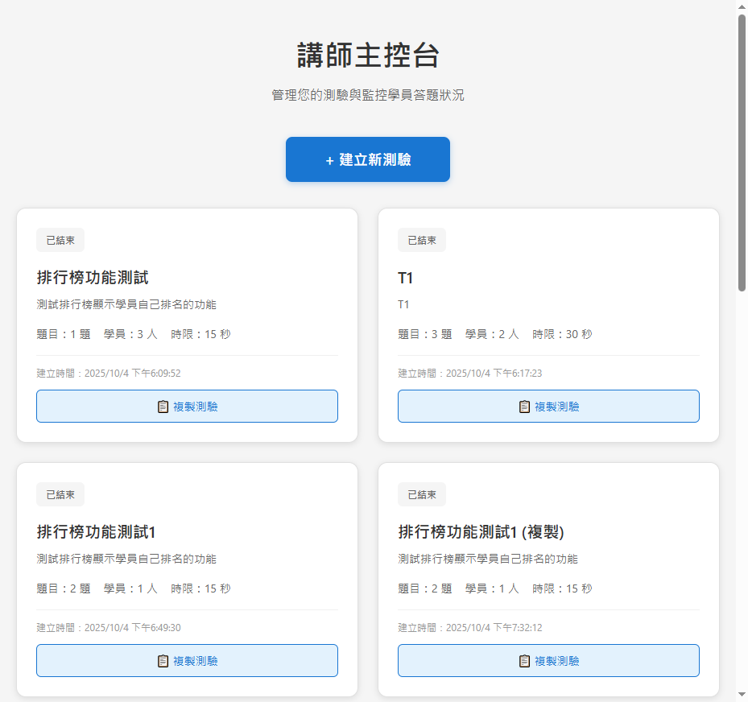

# 即時互動測驗統計系統 - 講師端操作 SOP

**版本**: v1.0
**最後更新**: 2025-10-05
**適用對象**: 系統講師/管理員

---

## 目錄

1. [系統簡介](#1-系統簡介)
2. [建立測驗](#2-建立測驗)
3. [啟動測驗與等待學員加入](#3-啟動測驗與等待學員加入)
4. [推送題目與查看統計](#4-推送題目與查看統計)
5. [結束測驗與查看排行榜](#5-結束測驗與查看排行榜)
6. [測驗管理功能](#6-測驗管理功能)
7. [常見問題與注意事項](#7-常見問題與注意事項)

---

## 1. 系統簡介

### 1.1 系統概述

即時互動測驗統計系統是一個講師與學員即時互動的測驗平台，支援以下核心功能：

- ✅ 建立多選題測驗
- ✅ 即時推送題目給學員
- ✅ 即時統計答題結果（長條圖/圓餅圖）
- ✅ QR Code 快速加入
- ✅ 倒數計時功能
- ✅ 即時排行榜

### 1.2 系統入口

**講師主控台入口**: `http://localhost:5173/instructor`


*圖 1-1：系統首頁 - 點擊「講師入口」進入主控台*


*圖 1-2：講師主控台 - 顯示所有測驗列表*

---

## 2. 建立測驗

### 2.1 進入建立測驗頁面

1. 在講師主控台點擊 **「+ 建立新測驗」** 按鈕
2. 進入測驗建立表單頁面


*圖 2-1：建立測驗 - 空白表單*

### 2.2 填寫基本資訊

填寫以下必填欄位：

| 欄位名稱 | 說明 | 範例值 |
|---------|------|--------|
| **測驗標題** | 測驗的主要名稱 | `Spring Boot 基礎測驗` |
| **測驗描述** | 測驗的詳細說明 | `測試學員對 Spring Boot 核心概念的理解` |
| **每題倒數時間** | 每題答題時限（5-300秒） | `30` 秒 |
| **累積統計圖表類型** | 選擇長條圖或圓餅圖 | `長條圖` |
| **排行榜顯示名次數** | 顯示前 N 名（5-100名） | `20` 名 |

### 2.3 新增題目

#### 步驟 1：填寫第一題

1. 在「題目內容」欄位輸入題目文字
2. 填寫至少 2 個選項（支援 A-Z 多選項）
3. 點擊 **「+ 新增選項」** 可增加更多選項
4. 在「正確答案」下拉選單中選擇正確選項
5. 選擇該題的統計圖表類型（長條圖/圓餅圖）


*圖 2-2：建立測驗 - 填寫第一題（4個選項範例）*

#### 步驟 2：新增更多題目

1. 點擊 **「+ 新增題目」** 按鈕
2. 重複步驟 1 的操作
3. 可使用 **「刪除題目」** 按鈕移除不需要的題目


*圖 2-3：建立測驗 - 新增第二題*

### 2.4 完成建立

1. 確認所有題目資訊無誤
2. 點擊 **「建立測驗」** 按鈕
3. 系統會自動跳轉至該測驗的監控頁面

> **注意事項**：
> - 測驗建立後進入「已建立」狀態，尚未啟動
> - 必須填寫至少 1 題才能建立測驗
> - 每題至少需要 2 個選項

---

## 3. 啟動測驗與等待學員加入

### 3.1 測驗監控頁面

建立測驗後會自動進入監控頁面，顯示以下資訊：

- 測驗標題與描述
- 測驗狀態（已建立/進行中/已結束）
- WebSocket 連線狀態（● 已連線）
- 學員列表
- 學員資訊統計


*圖 3-1：測驗監控頁 - 啟動前狀態*

### 3.2 啟動測驗

1. 點擊 **「啟動測驗」** 按鈕
2. 系統會：
   - 更新測驗狀態為「進行中」
   - 生成唯一的加入碼（6位英數字，例如：`U34IX2`）
   - 顯示 QR Code 供學員掃描
3. 按鈕會變更為 **「推送下一題」** 和 **「結束測驗」**


*圖 3-2：測驗已啟動 - 顯示 QR Code 與加入碼*

### 3.3 等待學員加入

#### 如何讓學員加入：

**方式一：掃描 QR Code**
- 學員使用手機掃描螢幕上的 QR Code
- 自動跳轉至學員註冊頁面

**方式二：手動輸入加入碼**
- 學員前往 `http://localhost:5173/student`
- 輸入 6 位加入碼（例如：`U34IX2`）

#### 監控學員加入狀態：

- 「學員列表」會即時更新顯示已加入的學員
- 右上角顯示目前加入人數（例如：`0 人`）
- 學員加入時會透過 WebSocket 即時通知

> **提示**：
> - 建議在投影螢幕上顯示 QR Code，方便學員掃描
> - 加入碼在測驗期間不會改變
> - 可在「學員資訊」分頁查看詳細資訊

---

## 4. 推送題目與查看統計

### 4.1 推送題目

#### 開始第一題：

1. 確認學員已加入（或可直接開始）
2. 點擊 **「推送下一題」** 按鈕
3. 系統會：
   - 透過 WebSocket 即時推送題目給所有學員
   - 在「當前題目」分頁顯示題目內容
   - 啟動倒數計時器（根據設定的秒數）


*圖 4-1：題目 1 已推送 - 學員端開始答題*

### 4.2 查看題目內容

在「當前題目」分頁可以看到：

- 題目編號（第 X 題 / 共 Y 題）
- 統計圖表類型
- 題目文字
- 所有選項（A、B、C、D...）
- **「👁️ 顯示答案」** 按鈕（預設隱藏答案）

### 4.3 顯示/隱藏正確答案

1. 點擊 **「👁️ 顯示答案」** 按鈕
2. 系統會在正確選項旁標示 **「✓ 正確答案」**
3. 按鈕變更為 **「🙈 隱藏答案」**


*圖 4-2：顯示正確答案 - 標示綠色勾選記號*

> **注意**：顯示答案僅在講師端顯示，不會推送給學員

### 4.4 查看答題統計

在「當前題目」分頁下方會即時顯示：

#### 統計圖表：
- 根據設定的圖表類型（長條圖/圓餅圖）顯示
- 即時更新每個選項的選擇人數
- 動態呈現答題分布

#### 統計數據：
- **📝 答題人數**：已提交答案的學員數量
- **✅ 正確率**：答對的學員百分比

### 4.5 查看累積統計

1. 切換至 **「累積統計」** 分頁
2. 可查看所有題目的累積答題狀況
3. 顯示學員的總體表現趨勢


*圖 4-3：累積統計圖表（暫無資料範例）*

### 4.6 推送下一題

1. 等待倒數計時結束（或手動判斷可進行下一題）
2. 點擊 **「推送下一題」** 按鈕
3. 重複 4.1-4.5 的步驟


*圖 4-4：題目 2 已推送*

> **提示**：
> - 題目推送後無法撤回
> - 時間到後學員無法再提交答案
> - 可根據現場狀況決定是否等待所有學員作答完畢

---

## 5. 結束測驗與查看排行榜

### 5.1 結束測驗

當所有題目推送完畢後：

1. 點擊 **「結束測驗」** 按鈕
2. 系統會：
   - 更新測驗狀態為「已結束」
   - 計算所有學員的總分
   - 生成排行榜
   - 透過 WebSocket 推送排行榜給所有學員

> **重要提示**：
> - 測驗結束後無法再重新開始
> - 學員端會同步顯示排行榜
> - 排行榜資料會永久保存

### 5.2 查看排行榜

1. 切換至 **「排行榜」** 分頁
2. 排行榜顯示內容：
   - 學員排名（前 N 名，依建立時設定）
   - 學員姓名
   - 學員頭像圖示
   - 總得分
   - 答對題數


*圖 5-1：排行榜頁面（暫無資料範例）*

### 5.3 返回主控台

1. 點擊左上角 **「返回主控台」** 按鈕
2. 回到講師主控台
3. 可查看該測驗的最終狀態（顯示「已結束」標籤）

---

## 6. 測驗管理功能

### 6.1 主控台測驗列表

在講師主控台可以看到所有測驗卡片，每張卡片顯示：

- 測驗狀態標籤（已建立/進行中/已結束）
- 測驗標題與描述
- 題目數量
- 學員數量
- 每題時限
- 建立時間
- 操作按鈕


*圖 6-1：講師主控台 - 測驗列表*

### 6.2 複製測驗

#### 使用場景：
- 需要建立相似的測驗
- 想保留原測驗的題目結構

#### 操作步驟：

1. 在測驗卡片上點擊 **「📋 複製測驗」** 按鈕
2. 系統會：
   - 複製所有題目與選項
   - 複製測驗設定（時限、圖表類型等）
   - 自動在標題後加上「(複製)」
   - 建立一個新的測驗（狀態：已建立）
3. 顯示成功訊息：`測驗「XXX (複製)」已成功複製！`


*圖 6-2：複製測驗成功提示*

> **注意事項**：
> - 複製的測驗不包含學員資料與答題記錄
> - 複製後的測驗可以獨立編輯，不影響原測驗
> - 複製的測驗狀態為「已建立」，需要重新啟動

### 6.3 編輯測驗

#### 可編輯條件：
- ⚠️ 僅限「已建立」狀態的測驗可編輯
- ❌ 「進行中」或「已結束」的測驗無法編輯

#### 操作步驟：

1. 在測驗卡片上點擊 **「✏️ 編輯測驗」** 按鈕
2. 進入編輯頁面（與建立頁面相同介面）


*圖 6-3：編輯測驗頁面*

3. 可修改的內容：
   - ✅ 測驗標題與描述
   - ✅ 每題倒數時間
   - ✅ 累積統計圖表類型
   - ✅ 排行榜顯示名次數
   - ✅ 題目內容
   - ✅ 選項內容
   - ✅ 正確答案
   - ✅ 新增/刪除題目
   - ✅ 新增/刪除選項

4. 完成編輯後點擊 **「更新測驗」** 按鈕
5. 或點擊 **「取消」** 按鈕放棄修改

> **提示**：
> - 編輯會立即生效
> - 建議在測驗啟動前完成所有編輯
> - 測驗一旦啟動就無法再編輯

### 6.4 刪除測驗

> **注意**：目前系統版本暫不支援測驗刪除功能
> 如需刪除，請聯繫系統管理員

---

## 7. 常見問題與注意事項

### 7.1 測驗狀態說明

| 狀態 | 說明 | 可執行操作 |
|-----|------|----------|
| **已建立** | 測驗已建立但尚未啟動 | 編輯、複製、啟動、刪除 |
| **進行中** | 測驗正在進行中 | 推送題目、查看統計、結束測驗 |
| **已結束** | 測驗已結束 | 查看結果、複製 |

### 7.2 WebSocket 連線狀態

- **● 已連線**（綠色）：正常連線
- **● 未連線**（紅色）：連線中斷，請重新整理頁面

### 7.3 注意事項

#### 建立測驗時：
- ✅ 每題至少需要 2 個選項
- ✅ 必須設定正確答案
- ✅ 倒數時間建議設定 15-60 秒（依題目難度調整）

#### 啟動測驗時：
- ⚠️ 測驗啟動後無法修改題目
- ⚠️ 建議先確認題目內容無誤再啟動
- ✅ 可以先啟動測驗再等待學員加入

#### 推送題目時：
- ⚠️ 題目推送後無法撤回
- ⚠️ 時間到後學員無法再作答
- ✅ 可根據現場狀況彈性控制節奏

#### 結束測驗時：
- ⚠️ 測驗結束後無法重新開始
- ✅ 排行榜資料會永久保存
- ✅ 可透過「複製測驗」功能快速建立新測驗

### 7.4 系統建議配置

- **推薦學員數**：5-300 人
- **推薦題目數**：3-20 題
- **推薦每題時限**：15-60 秒
- **推薦瀏覽器**：Chrome、Edge、Firefox（最新版本）

### 7.5 故障排除

| 問題 | 可能原因 | 解決方式 |
|-----|---------|---------|
| 無法啟動測驗 | 後端服務未啟動 | 確認 `http://localhost:8080` 可正常訪問 |
| WebSocket 未連線 | 網路問題或服務異常 | 重新整理頁面 |
| 學員無法加入 | 加入碼錯誤或測驗未啟動 | 確認測驗狀態為「進行中」 |
| 統計不更新 | WebSocket 連線中斷 | 檢查連線狀態並重新整理 |

---

## 附錄

### A. 快速操作流程圖

```
建立測驗 → 啟動測驗 → 等待學員 → 推送題目 → 查看統計 → 推送下一題 → ... → 結束測驗 → 查看排行榜
    ↓                                                                                ↓
 編輯/複製                                                                        返回主控台
```

### B. 系統技術資訊

- **前端技術**: React 18 + TypeScript + Vite
- **後端技術**: Spring Boot 3.2.0 + Java 21
- **即時通訊**: WebSocket (STOMP)
- **資料庫**: H2 Database (File-based)
- **前端埠號**: 5173
- **後端埠號**: 8080

### C. 相關文件

- [系統規格文件](spec.md)
- [API 文件](api.md)
- [後端 README](exam-system-backend/README.md)
- [前端 CLAUDE.md](exam-system-frontend/CLAUDE.md)

---

**文件結束**

如有任何問題或建議，請聯繫系統開發團隊。
